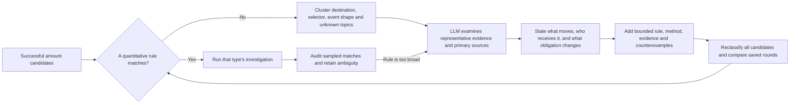

# How this study turns unfamiliar transactions into reusable methods

The unit of research is a completed Ethereum transaction, with block order retained for strategies involving several transactions. The five-hour window is fixed in `../eth_5h/manifest.json`; resuming a command must not move its boundaries. The quantitative screen is deliberately broader than a net-flow screen: largest observed address/asset change ≥ $10,000, event-supported flash principal ≥ $10,000, or gross priced transfer legs ≥ $100,000. These are absolute research thresholds, not significance tests or an allegation of suspicious activity.

For an asset `a` at an address `v`, compute `delta(v,a) = incoming - outgoing` from successful transfer logs and confirmed top-level native value. Rank `P = max(abs(delta(v,a)))`, retaining the address and asset. Record `G = sum(abs(transfer legs))` separately. A flash principal is a temporary funding requirement; `G` measures ledger traffic. Neither is revenue, profit, unique capital, or user trade size. Mint/burn totals remain explicit, while the zero address is excluded as an economic holder. A wrap changes the representation of a holding, and summing ETH and WETH movements would count the conversion more than once.

## The learning cycle

The LLM in this run is Codex reading saved evidence. The Python classifier does not call an external model. Its unknown queue, packets, notes, registry and per-occurrence investigations are the reusable hand-off. A later run can use the updated registry immediately and send new unresolved clusters back through the same procedure.

The persistent rule must describe a mechanism with measurable evidence. Avoid learning a transaction hash or an exact amount. Pin a contract address when protocol identity matters; a selector or event signature alone can be copied. Confirm the event source and relevant movements, and preserve failure conditions. A new destination with a familiar shape can be mechanically familiar while its protocol identity remains unresolved.

An accepted qualitative note answers:

1. Which assets move, and who is the economic principal, intermediary and beneficiary?
2. Which position changes: cash ownership, collateral, debt, vault shares, liquidity, or a cross-chain claim?
3. Which legs represent temporary funding or internal routing?
4. Which facts are directly observed, inferred, and missing?
5. Which features would recognize a future occurrence, and what nearby transaction would falsify that rule?

After promoting a rule, check other occurrences, a deterministic hash-sampled example, and neighbouring types. Saved rounds preserve the previous classifier, packets, labels and aggregate results. Increasing coverage is not evidence of increasing accuracy. If an investigation cannot distinguish two interpretations, retain a broader mechanical type and explicit uncertainty instead of inventing an intent.

## Known investigation methods

| Mechanism | Quantitative investigation | What the numbers can mean | What they do not establish |
|---|---|---|---|
| Transfer or distribution | Asset/recipient deltas, fan-in/out, sender activity, window net | Ownership movement, concentration or distribution | Exchange identity, common ownership, reason for payment |
| Swap or signed-order settlement | Opposite asset deltas at principal; swap/fill events; recipients; route length | Asset substitution and routing overhead | Trading profit when assets or internal ETH are missing |
| Flash-funded operation | Loan event and ordered same-token lend/repay pair; principal; fee; non-loan legs | Temporary funding supporting trades, debt changes or liquidation | Arbitrage merely because swaps occur |
| Lending | Pool identity, supply/withdraw/borrow/repay/liquidation events; reserve and beneficiary | Collateral or debt movement | Account health or leverage without before/after positions |
| Vault | Deposit/withdraw event, underlying and share flows, conversion rate | Asset claim exchanged for a share claim | New economic capital equal to gross underlying plus shares |
| PSM or stablecoin conversion | Conversion events, stablecoin burn/mint, reserve outflow, principal deltas | A change of dollar claim | External dollar issuance merely from an internal mint |
| Liquidity | Position ID or tick range, mint/burn/collect events, token flows; pair operations across time | Capital committed, repositioned or returned | Durable liquidity without measuring lifetime and intervening swaps |
| Bridge | Source-domain lock/burn or destination release; message identifiers and recipients | A cross-domain claim initiated or settled on Ethereum | Delivery on another chain from an Ethereum-only study |
| Sandwich-pattern candidate | Same sender, same pool/block, opposite-direction bracketing | An ordering pattern requiring follow-up | Malicious intent, positive profit or victim harm without replay |

Every selected transaction is recorded in `investigations.jsonl.gz` with its method, evidence and alternative matches. High-level family methods aggregate those records in `classified.json`. Generic family matches are useful for triage; they are not equivalent to a protocol-specific, fully validated investigation.

## Measurement limits

Only Ethereum mainnet is queried. This is a retrospective five-hour census, not a long-run frequency estimate. ETH/BTC use hourly endpoint marks; other feeds and wrapper rates use the window end. Stablecoins without feeds are assumed at parity. Those marks would introduce look-ahead if used in a trading backtest. Prices derived from unverified token pools are disabled in this primary run. Address-based token identities and onchain decimals are checked; a self-reported token symbol is not an identity proof.

Internal native transfers, call traces, pre/post storage, debt balances and cross-chain completion are not part of the full census. Non-log native candidates above the threshold get receipts; smaller non-log native amounts are omitted from address value profiles. Logged token movements and large native transfers provide the main economic evidence. Token events can differ from actual balance changes for rebasing or nonstandard tokens. Window-level USD flow nets use transfer-time marks and are not balance-based portfolio returns.

Official references: [Ethereum receipts and logs](https://ethereum.org/developers/docs/apis/json-rpc/), [Morpho flash-loan event definition](https://github.com/morpho-org/morpho-blue/blob/main/src/libraries/EventsLib.sol), [Morpho deployments](https://docs.morpho.org/developers/contracts/addresses/), [CoW settlement contracts](https://docs.cow.fi/cow-protocol/reference/contracts/core), [ERC-4626 vault standard](https://eips.ethereum.org/EIPS/eip-4626), and [Curve event definitions](https://github.com/curvefi/curve-contract/blob/master/contracts/pools/seth/StableSwapSETH.vy).
