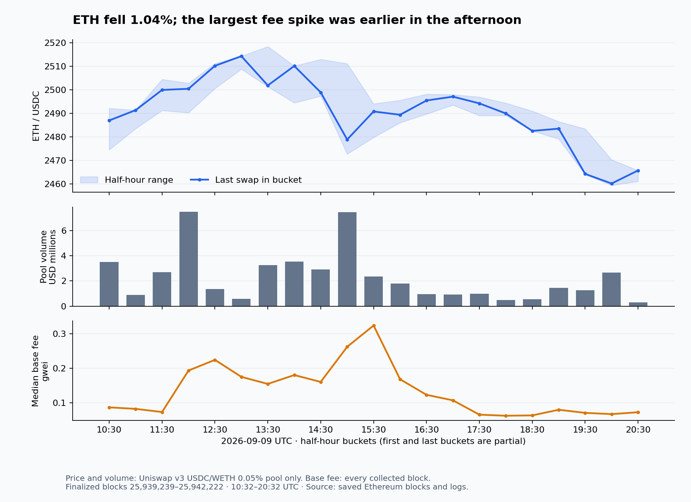

# Ethereum mainnet live scan: 2026-09-09T10:32:35+00:00 to 2026-09-09T20:32:23+00:00 UTC

Blocks 25939239 to 25942222 (2984 blocks, 10.00 h), 861,766 transactions, 2,365,900 logs. Prices at head block 25942222: ETH $2466, BTC $78k. Generated 2026-09-10T10:20:17+00:00 UTC by `scripts/live_scan.py`; the narrative section is written by the LLM from `analysis.json` and `head_state.json`, every table below is deterministic.

## Ten hours of Ethereum: turnover, priority fees, and narrow lending edges

**Window: 9 September 2026, 10:32–20:32 UTC** (14:32–00:32 Asia/Tbilisi). This is the trailing ten-hour window pinned
to the finalized head when collection began, not a moving window at report publication. The local session date is
10 September. Every block and log in blocks **25,939,239–25,942,222** is present: **2,984 blocks, 861,766 transactions,
2,365,900 logs**, and **257,466 distinct transaction senders**. [[verify: blocks]] [[verify: transactions]]
[[verify: logs]] [[verify: window-complete]] [[verify: activity-senders]]

ETH fell **1.04%**, decoded DEX turnover reached **$489.89m**, and covered lending protocols recorded only **$121 of
liquidated debt**. The most useful new finding concerns what the turnover measures: **four flash-funded roundtrips
created $34.62m of settled swap volume, 7.07% of the total, while extracting only $0.65 of WETH from the pools before
gas**. The new detector found the second pool after being written from the first example.

The chart uses the Uniswap v3 USDC/WETH 0.05% pool, not an exchange index. It opened at **2,491.52 USDC per ETH**,
reached **2,518.38**, traded as low as **2,459.37**, and closed at **2,465.68**, across 2,810 swaps and $47.39m of
USDC-side notional. The 15:00–15:30 UTC bucket combined $7.44m of that pool's turnover with the window's highest
base fee. The fee spike preceded the final leg down after 19:30; these observations do not establish a causal link.
Source: [activity tables](activity_tables.md), [event data](events.json).

| Decoded venue family | Gross priced swap volume |
|---|---:|
| Uniswap v4 | $188.99m |
| Uniswap v3 | $181.08m |
| Curve | $63.94m |
| v2-style | $52.91m |
| Balancer | $2.97m |

These are settled pool legs valued with the study's token registry and pinned price basis. Routed trades and recycled
capital can appear more than once; unsupported or unpriced assets are excluded. They are not unique customer spend.

### 1. Four transactions explain most of the v2-style turnover

| Pool | Roundtrips | Gross turnover | Pool WETH lost, USD | Visible surplus less execution gas |
|---|---:|---:|---:|---:|
| [7AΩ∞ / WETH](https://etherscan.io/address/0xcb62c2d6894736d4216a41f5812bb9771de056d5) | 3 | $14,796,862 | $0.2922 | $0.0970 |
| [BULL / WETH](https://etherscan.io/address/0x28cd762e49726a4f0725a2846c85d19462b3e563) | 1 | $19,819,951 | $0.3581 | $0.1967 |

Together these account for **65.43% of v2-style volume**. Both pairs are confirmed by `getPair` on the canonical
Uniswap v2 factory. The detector checks actual WETH Transfer logs against the Swap amounts, and the follow-up checks
successful receipts, canonical block hashes, and historical reserves. The turnover really settled.

In [the first 7AΩ∞ transaction](https://etherscan.io/tx/0xf50f34a5a0885bff97fca92e6b48b07e413dc1124587ca01deca3f0b26b25992),
roughly 1,000 WETH arrives through a Balancer flash loan, buys almost the pool's entire token inventory, and is recovered
by selling the same tokens after a small token-side reserve reduction. The loan is repaid, leaving roughly
0.0000396 WETH. The sequence repeats three times. This pool started with only **0.02301 WETH** on its WETH side.
Its WETH reserve ends lower, not $44,391 higher as a naive `turnover × 0.3%` dollar-fee interpretation would suggest.

The [BULL transaction](https://etherscan.io/tx/0x2d1fc502cbd8c511b2919aadcc0e013a453ae902ea268ef1d91abfc8ad513e40)
uses **4,018.4 WETH from Morpho** against a pool with only **0.03601 WETH**, removes 1% of the tiny remaining token
reserve between the two swaps, and repays the flash loan. Its priced surplus before gas is about $0.36.

**Interpretation:** gross fee amounts valued at temporary execution prices do not establish realizable LP income through
these extreme price reversals. Keep the gross volume, flag the recycling, and measure retained balances separately.
The combined **$0.2936 after gas** is visible WETH surplus less transaction fees; other internal payments and unpriced
assets are not included, so this is not a complete operator-profit calculation. This is a data-quality finding, not
an attractive trading strategy. [RPC and reserve evidence](roundtrip_evidence.json), [reusable detector](../../../scripts/detectors/recycled_swap_volume.py).

### 2. Cheap base fees coexist with expensive priority

Execution base-fee burn, summed over **every block**, was **12.3571 ETH**, about **$30,474** at the pinned ETH/USD feed.
Gas used was **90.402bn**, or **50.50% of the aggregate gas limit**. [[verify: execution-burn]] [[verify: activity-gas]]
[[verify: activity-fullness]] This is close to the fee mechanism's target of half the maximum gas limit; it does not
by itself demonstrate underutilization. [Ethereum fee specification overview](https://ethereum.org/developers/docs/gas/).

The receipt census covers every fourth produced block: **746 blocks, 215,777 transactions**, with complete transaction
sets and gas totals verified against each sampled block. Within that sample, users paid **13.6231 ETH in tips** versus
**3.0712 ETH burned**, a **4.44× ratio**. Multiplying sampled tips by four gives a **54.49 ETH estimate** for the whole
window; it is an extrapolation from a systematic sample, not an exact total or a statistical confidence interval.

| Gas-weighted observed effective fee, including tips | gwei |
|---|---:|
| Median | 0.2370 |
| 75th percentile | 0.7064 |
| 90th percentile | 2.0578 |
| 99th percentile | 4.0048 |

Only **6.97% of sampled gas paid exactly zero tip**; **33.16% paid at most 0.01 gwei**, while **13.92% paid more than
1 gwei**. Failed transactions consumed **1.86% of sampled gas**. USDT and USDC contracts together consumed **13.63%**
of sampled gas by top-level destination; that is contract attribution, not a complete classification of internal work.

The highest per-gas tip in the full block scan belongs to a
[BAIT sale at 18:30:47 UTC](https://etherscan.io/tx/0xad4ec59b8712ec25d1984d650bc7a20f98c2ebc8168bf1beca4a152423c8888b):
the receipt confirms **0.6434 ETH of tips, about $1,587**, to receive 34.746 WETH from its pool, while the block base
fee was around 0.059 gwei. That proves a costly priority purchase, not the buyer's profit or the reason for urgency.

The economics detectors now use the observed effective-fee p75 for ordinary actions and p90 for competing JIT
execution, with provenance and window checks. These are sensitivity scenarios, not inclusion guarantees. Tips here
exclude direct builder/proposer payments, other MEV transfers, and blob fees. [Fee census](fee_census.json),
[priority transaction receipts](rpc_followup.json).

### 3. Lending: little liquidation, meaningful liquidity allocation

The covered Aave, Spark and Morpho decoders found **two liquidations**, repaying **$120.87** in total:
[$115.70 on Morpho](https://etherscan.io/tx/0x298de3c17d38c28b49dbd13421ce32e577ef77859fc0b55a78061fd7f8204d5f)
and [$5.17 on Aave](https://etherscan.io/tx/0xb49b76b284ec18934ac02ef4cc040880587290a75e82784b3c71b98058ea9d51).
Morpho's collateral token is unpriced here. These counts say little liquidation was observed in this coverage; they
do not establish the absence of leverage or stress everywhere on Ethereum.

Of **49 selected active borrower/venue records** queried at the endpoint, two large Aave accounts merit monitoring:

| Account | Debt | Health factor | Uniform collateral-value decline to HF=1 |
|---|---:|---:|---:|
| [0xcf0a12cb…](https://etherscan.io/address/0xcf0a12cbd8088fc5f84ad431e71787157041cd69) | $26.425m | 1.02001 | 1.96% |
| [0xca686974…](https://etherscan.io/address/0xca686974913389d42f3c5f61010503daccdb487a) | $8.273m | 1.02350 | 2.30% |

The last column holds debt values and liquidation thresholds fixed. It is **not an ETH-price liquidation threshold**:
correlated collateral and debt prices can move together, and the asset composition was not decomposed. All 49 records
pass the health-factor and LTV consistency checks. [[verify: head-health-identity]]

There was also sizeable balance-sheet movement. Account
[0x99926ab8…](https://etherscan.io/address/0x99926ab8e1b589500ae87977632f13cf7f70f242) withdrew 10,000 WETH from Aave,
supplied 16,000 WETH to Spark, then borrowed $20m of USDT; its endpoint Spark debt was $46.0m at HF 1.199.
Spark's labelled allocator supplied **$50.15m** and **$39.56m** of USDT, then withdrew **$46.87m** later in the window.
Spark's observed USDT supply rate moved from **6.08%** to **3.39%**, with a **2.62%** low. This rate is visibly tied to
large liquidity movements. No blackout detector fired; the window does not span the previously documented midnight routine.

### 4. What remains worth investigating at real size

The endpoint rate comparison uses **Sky's 3.60% savings rate as a benchmark**, with issuer, conversion and contract risk;
it is not a risk-free asset. These are conditional research candidates, not executable quotes.

| Candidate | Measured economics | Constraint / next check |
|---|---|---|
| Compound USDC supply | 4.524% at the endpoint; the saved curve puts the best tested size versus 3.60% near **$615k**, worth **$2.8k/year** if unchanged | $1m takes the rate to 3.758%; $5m to 3.212%. Recheck borrows and the kink; one pinned state is not persistence. |
| Aave USDtb supply | 4.879% headline; **$74.5k** best tested size, about **$481/year** over the benchmark | Only 15 reserve updates, below the detector's de-spiking threshold. A small borrower repayment can erase the edge. |
| Existing USDT supply, Compound → Aave | 3.087% versus 3.632% at the endpoint | The detector's **$120.9m** destination optimum exceeds Compound's **$25.9m** supplied-minus-borrowed balance. Actual source liquidity, position ownership and changing source rates constrain any switch. |
| USDC/USDT v3 LP | At $1m and the retrospectively selected **±0.015%** band, about **$122.50** modeled fees less divergence over these ten hours | Only about **$81** above the benchmark before gas/rebalancing. The 10.73% annualization assumes repetition of an exceptionally narrow observed range. |
| USDC/USDG v4 LP | At $1m and **±0.024%**, about **$93.70** modeled window income, **$53** above the benchmark | Top taker supplied 57.65% of observed volume. Recheck flow recurrence, tick-valid placement, hooks and price excursions. |

A raw annualized LP ranking is not sufficient: bandwidth chosen after seeing the window, tick spacing, adverse
selection and rebalancing remain material. The unknown-token rows printing triple-digit annual rates do not have enough
identity and execution evidence to promote. JIT captured only about **$269** across 194 detected episodes; the aggregate
pool-fee denominator includes modeled fee values, including the recycling example, so its printed share is not a measured
share of realized LP profits.

The existing [strategy book](strategy_book.txt) now has seven linked strategies re-quoted from this window. The sUSDe
redemption finding was absent; two unlinked strategies retain historical quotes rather than acquiring invented current
ones. [Capacity calculations](summary.json), [detector economics](detectors.json).

### 5. Exchange flow, pegs, blobs and automated activity

Labelled exchanges show **$72.43m net stablecoin outflow** and **$24.32m net native ETH inflow** on priced legs at least
$10,000. [[verify: exchange-net-stables]] [[verify: exchange-net-eth]] The stablecoin sign survives removing behavioural
labels: **−$77.21m** on the model-memory tier alone. However, the verified-only tier covers only one exchange address,
so this is label-dependent evidence, not a fully verified exchange census. Native ETH excludes internal transfers and
does not have complete receipt-status coverage. Transfers to an exchange also do not prove a sale.

Gross USDC exchange inflow was **$1.7145bn**, including a
[268m-USDC transfer to the Coinbase-labelled wallet](https://etherscan.io/tx/0xcb49d1a9bac5baa89a55281be14f291ad8db89403268a06b943ed26c5e0bb9d5).
[[verify: exchange-gross-usdc]] USDC zero-address mint and burn totals were roughly **468.65m and 463.28m tokens**;
these include bridge operations and cannot be read directly as new fiat subscriptions. [[verify: usdc-mint]]
[[verify: usdc-burn]] The largest CCTP destination aggregate was **$30.0m to Aptos**, almost entirely one recipient.
[[verify: cctp-largest]] All decoded outbound bridge families totalled $160.8m; the $88.34m inbound figure covers CCTP
only, so subtracting these would not produce a comparable net bridge flow.

Large dollar markets stayed near par: volume-weighted USDT **0.999756**, USDS **0.999936**, USDG **0.999903**, and
USDe **0.999859**. The exception worth a separate check is **legacy FRAX at 0.99207**, about 79bp below par, on only
$120k across 72 priced swaps. That is a thin-market observation, not a demonstrated redemption arbitrage; frxUSD is
a different token and traded close to par. USD0's 1.0202 VWAP versus 0.9990 median is another small-sample outlier,
not enough evidence for a broad premium claim.

The chain carried **22,821 blobs**: Base posted **8,078 (35.4%)**, Robinhood Chain **6,381 (28.0%)**, and together
they account for **63.4%**. [[verify: activity-blobs]] [[verify: blob-header-identity]] Builder extra-data strings
attribute 48.5% of blocks to Titan, 19.2% to Quasar and 14.4% to BuilderNet; these are self-reported block tags, not
validator ownership. Consensus withdrawals totalled **7,377.66 ETH**, including 5,316.9 ETH in the 19:00 bucket.
Withdrawals alone do not establish selling. [[verify: activity-withdrawals]]

The existing delegated-dust detector also found a large continuing campaign: one operator's calldata encodes
**175,378 transfer legs** targeting **20,729 wallets**, through **11,956 executing accounts**. Of 84,483 legs with
in-window counterparties available to test, 27,872 (**33.0%**) use a sender matching the first four and last four hex
characters of another counterparty. This is strong evidence of address-poisoning intent. Calldata counts describe
encoded attempts; complete internal execution and recipient losses were not established. [Examples and detector evidence](detectors.md).

### Reproducibility and next research steps

The [method](method.md) records commands, coverage and price basis. Raw block/log integrity passes; seven distributed
canonical-header rechecks match. The final verifier independently recomputes **21 aggregate checks** and passes
**eight groups of protocol identities**, including the corrected Aave account-data decoder. The detector sweep ran
**16 detectors with 68 hits and no errors**. A passing check supports its named recipe, not every inference in this report.

Infrastructure now pins collection/resume boundaries and state reads, enriches discovered borrowers without moving
the price basis, batches RPC state reads concurrently, rejects incomplete receipt samples, prices execution with
observed tips, and detects recycled swap volume. Exact verifier comparisons now have zero absolute tolerance;
previously the default one-unit allowance could hide a one-block or sub-ETH discrepancy. Tests and validation are
recorded in [validation.json](validation.json).

The next useful work is targeted: decompose the two low-HF accounts' collateral/debt exposure; quote lending rates at
multiple historical points and constrain single-chain switches by the source's exit liquidity; and extend the new
roundtrip detector into a complete balance-delta fee measurement. The present evidence supports monitoring these
mechanisms. It does not establish a large, persistent, executable arbitrage.

---

## A. Passive LP economics (fees to in-range liquidity, minus what just-in-time liquidity takes)

Per pool with at least 3 priced swaps and $200k of volume. `full-range capital` is the USD value a full-range position would need to hold the pool's in-range liquidity (2·L·√P); the band APRs scale that by the capital a ±1% or ±0.1% band needs for the same liquidity (×201 and ×2001) and assume the price stays inside the band, so they are gross ceilings before impermanent loss and rebalancing, not returns. `price range` is the max/min of the pool price in the window. Fees are the fee tier times input volume; v4 tiers come from the event, v3 tiers from `fee()`, v2-like pools are assumed 0.30%.

**Recycled turnover:** the detector found same-pool atomic round trips in 2 pool(s). For flagged rows, `fees*` is only gross volume times an assumed tier; realized passive income is unmeasured. Token balance changes through the round trip can contradict that USD fee estimate. See [detector evidence](detectors.md).

| pool | venue | pair | tier | swaps | volume | fees | to JIT | passive fees | full-range capital | APR full-range | APR ±1% band | price range |
|---|---|---|---|---|---|---|---|---|---|---|---|---|
| 0x3b1b…d5b9 | uni v4 | USDT/USDS | 0.00% | 770 | $52.7M | $316 | $0 | $316 | $100.0B | 0.00% | 0.1% | 0.018% |
| 0x0fb0…3239 | uni v4 | USDC/USDT | 0.00% | 1235 | $51.9M | $467 | $1 | $467 | $39.2B | 0.00% | 0.2% | 49.329% |
| [0x88e6…5640](https://etherscan.io/address/0x88e6a0c2ddd26feeb64f039a2c41296fcb3f5640) | uni v3 | USDC/WETH | 0.05% | 2810 | $47.4M | $24k | $86 | $24k | $529.6M | 3.91% | 786.8% | 2.399% |
| [0x4e68…fa36](https://etherscan.io/address/0x4e68ccd3e89f51c3074ca5072bbac773960dfa36) | uni v3 | WETH/USDT | 0.30% | 736 | $24.4M | $73k | $6 | $73k | $1.8B | 3.54% | 713.1% | 1.897% |
| [0xe055…939f](https://etherscan.io/address/0xe0554a476a092703abdb3ef35c80e0d76d32939f) | uni v3 | USDC/WETH | 0.01% | 8903 | $22.2M | $2221 | $3 | $2218 | $57.8M | 3.36% | 677.2% | 19.376% |
| [0x4f49…3c85](https://etherscan.io/address/0x4f493b7de8aac7d55f71853688b1f7c8f0243c85) | curve | USDC/USDT | ? | 370 | $21.0M | – | $0 | – | – | – | – | – |
| [0xc061…1622](https://etherscan.io/address/0xc061caa073f3d95f80f8e5428d32d2d76f5e1622) | curve | USDC/USDG | ? | 74 | $15.0M | – | $0 | – | – | – | – | – |
| [0xcb62…56d5](https://etherscan.io/address/0xcb62c2d6894736d4216a41f5812bb9771de056d5) | uni v2_like | 0x622b…bf2d/WETH | ? | 6 | $14.8M | $44k* | $0 | unmeasured* | – | – | – | – |
| 0xe63e…5d45 | uni v4 | PYUSD/USDS | 0.00% | 190 | $12.8M | $77 | $0 | $77 | $149.1B | 0.00% | 0.0% | 0.007% |
| [0x5653…83b2](https://etherscan.io/address/0x56534741cd8b152df6d48adf7ac51f75169a83b2) | uni v3 | WBTC/USDT | 0.05% | 753 | $12.3M | $6127 | $0 | $6127 | $273.5M | 1.96% | 395.5% | 2.020% |
| 0x395f…13a5 | uni v4 | USDC/USDT | 0.00% | 645 | $12.1M | $121 | $1 | $121 | $10.8B | 0.00% | 0.2% | 17.022% |
| [0x1529…f52a](https://etherscan.io/address/0x1529b58cefc7296e742028b4d445451a9c92f52a) | uni v2_like | Dibs/WETH | ? | 64 | $11.2M | $34k | $0 | $34k | – | – | – | – |
| [0xbafe…8e5d](https://etherscan.io/address/0xbafead7c60ea473758ed6c6021505e8bbd7e8e5d) | uni v3 | AUSD/USDC | 0.01% | 37 | $11.1M | $1107 | $0 | $1107 | $543.8B | 0.00% | 0.0% | 0.004% |
| [0xc7bb…0e9b](https://etherscan.io/address/0xc7bbec68d12a0d1830360f8ec58fa599ba1b0e9b) | uni v3 | WETH/USDT | 0.01% | 5574 | $8.9M | $895 | $1 | $894 | $23.3M | 3.37% | 678.2% | 52.700% |
| [0x3416…27c6](https://etherscan.io/address/0x3416cf6c708da44db2624d63ea0aaef7113527c6) | uni v3 | USDC/USDT | 0.01% | 558 | $8.9M | $894 | $0 | $893 | $83.9B | 0.00% | 0.2% | 0.015% |
| 0x56fc…48c1 | uni v4 | USDe/USDC | 0.00% | 133 | $7.2M | $224 | $2 | $221 | $12.4B | 0.00% | 0.3% | 0.107% |
| [0xbebc…f1c7](https://etherscan.io/address/0xbebc44782c7db0a1a60cb6fe97d0b483032ff1c7) | curve | DAI/USDT | ? | 46 | $6.0M | – | $0 | – | – | – | – | – |
| [0x11b8…97f6](https://etherscan.io/address/0x11b815efb8f581194ae79006d24e0d814b7697f6) | uni v3 | WETH/USDT | 0.05% | 1323 | $5.0M | $2523 | $8 | $2515 | $58.3M | 3.78% | 760.8% | 2.397% |
| [0x5b03…8e96](https://etherscan.io/address/0x5b03cccab7ba3010fa5cad23746cbf0794938e96) | curve | USDe/USDT | ? | 110 | $5.0M | – | $0 | – | – | – | – | – |
| 0x8aa4…4e47 | uni v4 | USDC/USDT | 0.00% | 388 | $4.9M | $58 | $0 | $58 | $19.0B | 0.00% | 0.1% | 0.017% |
| [0x4585…20c0](https://etherscan.io/address/0x4585fe77225b41b697c938b018e2ac67ac5a20c0) | uni v3 | WBTC/WETH | 0.05% | 393 | $4.4M | $2206 | $20 | $2186 | $356.4M | 0.54% | 108.3% | 0.836% |
| [0xa6cc…93e8](https://etherscan.io/address/0xa6cc3c2531fdaa6ae1a3ca84c2855806728693e8) | uni v3 | LINK/WETH | 0.30% | 386 | $4.4M | $13k | $0 | $13k | $130.8M | 8.84% | 1780.9% | 4.617% |
| 0x21c6…ca27 | uni v4 | ETH/USDC | 0.06% | 700 | $3.8M | $2402 | $0 | $2402 | $76.2M | 2.76% | 556.6% | 2.367% |
| [0xf4d0…96d7](https://etherscan.io/address/0xf4d0cf32908b2c7f1021339c43df0f77f06896d7) | curve | 0x2323…aa71/USDC | ? | 50 | $3.6M | – | $0 | – | – | – | – | – |
| [0x390f…7bf4](https://etherscan.io/address/0x390f3595bca2df7d23783dfd126427cceb997bf4) | curve | USDT/crvUSD | ? | 135 | $3.6M | – | $0 | – | – | – | – | – |
| 0x50b0…5fa8 | uni v4 | ETH/USDT | 0.35% | 172 | $3.4M | $12k | $0 | $12k | $292.4M | 3.58% | 721.7% | 1.802% |
| 0x9007…79b3 | uni v4 | ETH/USDT | 0.03% | 850 | $3.4M | $545 | $0 | $545 | $60.2M | 0.79% | 159.8% | 2.427% |
| [0x8ad5…e6d8](https://etherscan.io/address/0x8ad599c3a0ff1de082011efddc58f1908eb6e6d8) | uni v3 | USDC/WETH | 0.30% | 270 | $3.2M | $9600 | $0 | $9600 | $278.1M | 3.02% | 609.2% | 1.882% |
| [0x1d42…d801](https://etherscan.io/address/0x1d42064fc4beb5f8aaf85f4617ae8b3b5b8bd801) | uni v3 | UNI/WETH | 0.30% | 476 | $3.1M | $9195 | $0 | $9195 | $139.6M | 5.77% | 1162.5% | 2.937% |
| 0xdce6…f78d | uni v4 | ETH/USDC | 0.35% | 145 | $2.9M | $10k | $0 | $10k | $286.0M | 3.10% | 623.9% | 1.798% |
| 0xb2b5…e2e4 | uni v4 | ETH/LINK | 0.35% | 95 | $2.8M | $9629 | $0 | $9629 | $222.9M | 3.79% | 762.6% | 1.783% |
| [0x48da…1406](https://etherscan.io/address/0x48da0965ab2d2cbf1c17c09cfb5cbe67ad5b1406) | uni v3 | DAI/USDT | 0.01% | 109 | $2.5M | $249 | $4 | $245 | $5.3B | 0.00% | 0.8% | 0.562% |
| 0xb90d…b716 | uni v4 | USDC/USDG | 0.01% | 109 | $2.4M | $200 | $0 | $200 | $9.4B | 0.00% | 0.4% | 0.024% |
| [0x9db9…425b](https://etherscan.io/address/0x9db9e0e53058c89e5b94e29621a205198648425b) | uni v3 | WBTC/USDT | 0.30% | 110 | $2.3M | $6936 | $0 | $6936 | $296.3M | 2.05% | 413.2% | 1.511% |
| 0x9035…eb4f | uni v4 | RLUSD/USDS | 0.00% | 33 | $2.3M | $14 | $0 | $14 | $40.0B | 0.00% | 0.0% | 0.009% |
| 0xe500…a657 | uni v4 | ETH/WETH | 0.03% | 819 | $1.8M | $299 | $0 | $299 | $62.0M | 0.42% | 85.1% | 2.341% |
| [0xd51a…ae46](https://etherscan.io/address/0xd51a44d3fae010294c616388b506acda1bfaae46) | curve | WETH/USDT | ? | 714 | $1.8M | – | $0 | – | – | – | – | – |
| 0x5459…df9a | uni v4 | tBTC/cbBTC | 0.01% | 11 | $1.7M | $214 | $0 | $214 | $20.0B | 0.00% | 0.2% | 0.032% |
| [0xe6d7…e76a](https://etherscan.io/address/0xe6d7ebb9f1a9519dc06d557e03c522d53520e76a) | uni v3 | USDe/USDC | 0.01% | 65 | $1.5M | $150 | $0 | $150 | $9.3B | 0.00% | 0.3% | 0.046% |
| [0xb31e…5bc3](https://etherscan.io/address/0xb31e70454bdf5bc3) | balancer | USDC/WETH | ? | 66 | $1.5M | – | $0 | – | – | – | – | – |
| [0x13e1…43e1](https://etherscan.io/address/0x13e12bb0e6a2f1a3d6901a59a9d585e89a6243e1) | curve | frxUSD/crvUSD | ? | 44 | $1.3M | – | $0 | – | – | – | – | – |
| 0xb2b9…3a17 | uni v4 | EURC/USDC | 0.04% | 191 | $1.3M | $481 | $0 | $481 | $775.9M | 0.05% | 10.9% | 0.184% |
| 0x7233…ca73 | uni v4 | ETH/USDT | 0.06% | 623 | $1.2M | $749 | $0 | $749 | $24.4M | 2.69% | 541.1% | 2.372% |
| 0x9a5c…5167 | uni v4 | UNI/USDC | 0.35% | 223 | $1.1M | $3824 | $0 | $3824 | $30.2M | 11.11% | 2238.6% | 4.904% |
| [0x383e…8559](https://etherscan.io/address/0x383e6b4437b59fff47b619cba855ca29342a8559) | curve | PYUSD/USDC | ? | 32 | $1.0M | – | $0 | – | – | – | – | – |

Just-in-time liquidity: 194 episodes (mint and burn of identical liquidity inside one block), bracketing $886k of swaps and taking about $269 of fees. Operators:

- [0xae2f…ae13](https://etherscan.io/address/0xae2fc483527b8ef99eb5d9b44875f005ba1fae13): 69 episodes, fees taken $179
- [0x3ee9…c1de](https://etherscan.io/address/0x3ee92cd00993a4488ae153ab41ac7947cbcbc1de): 18 episodes, fees taken $76
- [0x654f…4be4](https://etherscan.io/address/0x654fae4aa229d104cabead47e56703f58b174be4): 16 episodes, fees taken $5
- [0x4a54…248c](https://etherscan.io/address/0x4a54d76d7235d69e6d41bc26b5b431ff9f66248c): 12 episodes, fees taken $0
- [0xe204…4ae5](https://etherscan.io/address/0xe20446cccbfd5f9038e747f1dea8016ecbd94ae5): 9 episodes, fees taken $0
- [0xab56…03e2](https://etherscan.io/address/0xab567bb4953ac3b184e6078dd8d3d1dbf2dc03e2): 8 episodes, fees taken $2
- [0x27c2…2bf2](https://etherscan.io/address/0x27c2a1733f14e1247c5feb1c37cd52ae7d0d2bf2): 7 episodes, fees taken $4
- [0x3437…e4ab](https://etherscan.io/address/0x34373bba18aa058f889c3fc28329c0bfb4b3e4ab): 6 episodes, fees taken $0

Swap volume by venue: uniswap_v4 $189.0M (31965), uniswap_v3 $181.1M (59403), curve $63.9M (3580), uniswap_v2_like $52.9M (26676), balancer $3.0M (700).

Uniswap v4 pools whose reported swap deltas were not matched by tokens moving through the PoolManager (hook-settled; excluded from volume): 0xdb4c…43b1 (0x0000…0000/0xc8fb…8888, 224 swaps); 0x230e…804d (0x0000…0000/0xa0df…c845, 208 swaps); 0xdbeb…8cb3 (0x0000…0000/0x8602…2148, 201 swaps); 0x00b9…22d7 (0x0000…0000/0xa0b8…eb48, 173 swaps); 0x2287…1bba (0x0000…0000/0xdac1…1ec7, 155 swaps); 0xd4e5…909d (0x0000…0000/0xa0b8…eb48, 115 swaps); 0xce28…0c2f (0x0000…0000/0xa27e…62d2, 113 swaps); 0x72da…f169 (0xa0b8…eb48/0xaca9…35da, 104 swaps); 0x15d6…1935 (0x0000…0000/0x3270…a4ca, 90 swaps); 0x6a0f…27b1 (0x14d6…47a1/0xb10c…6f45, 89 swaps).

## B. Lending: rates, utilisation, dispersion, health

Current reserve state at the head (`getReserveData`, aToken and variable-debt supply):

| venue | asset | supply APR | borrow APR | utilisation | supplied | borrowed |
|---|---|---|---|---|---|---|
| Aave v3 | tBTC | 0.00% | 0.26% | 0.2% | $134.6M | $204k |
| Aave v3 | EURC | 2.34% | 3.99% | 65.2% | $46.8M | $30.5M |
| Aave v3 | UNI | 0.00% | 0.17% | 1.1% | $3.0M | $33k |
| Aave v3 | WBTC | 0.00% | 0.33% | 2.5% | $2.7B | $66.5M |
| Aave v3 | GHO | 0.00% | 4.00% | 83.4% | $135.2M | $112.7M |
| Aave v3 | USDe | 1.31% | 5.68% | 30.7% | $664.7M | $204.1M |
| Aave v3 | LINK | 0.01% | 0.52% | 3.4% | $98.2M | $3.3M |
| Aave v3 | LUSD | 0.54% | 2.06% | 33.0% | $1.9M | $626k |
| Aave v3 | DAI | 3.08% | 4.72% | 86.9% | $131.5M | $114.3M |
| Aave v3 | PYUSD | 3.89% | 4.91% | 88.0% | $7.6M | $6.7M |
| Aave v3 | wstETH | 0.00% | 0.00% | 0.3% | $2.8B | $7.1M |
| Aave v3 | AAVE | 0.00% | 0.00% | 0.0% | $104.3M | $0 |
| Aave v3 | LBTC | 0.00% | 0.00% | 0.0% | $210.5M | $1331 |
| Aave v3 | RLUSD | 2.10% | 4.37% | 60.0% | $4.6M | $2.8M |
| Aave v3 | sDAI | 0.00% | 0.00% | 0.0% | $51k | $0 |
| Aave v3 | FRAX | 2.71% | 4.55% | 74.9% | $39k | $29k |
| Aave v3 | sUSDe | 0.00% | 0.00% | 0.0% | $255.5M | $0 |
| Aave v3 | MKR | 0.00% | 0.16% | 1.1% | $183k | $1940 |
| Aave v3 | USDC | 3.63% | 4.29% | 93.8% | $2.3B | $2.2B |
| Aave v3 | rsETH | 0.00% | 0.00% | 0.0% | $921.1M | $2863 |
| Aave v3 | rETH | 0.00% | 0.02% | 0.1% | $102.5M | $117k |
| Aave v3 | cbETH | 0.00% | 0.05% | 0.3% | $16.1M | $54k |
| Aave v3 | ezETH | 0.00% | 0.00% | 0.0% | – | – |
| Aave v3 | WETH | 1.44% | 2.04% | 83.2% | $5.3B | $4.4B |
| Aave v3 | USDtb | 4.88% | 7.49% | 81.4% | $15.5M | $12.6M |
| Aave v3 | ENS | 0.09% | 1.46% | 7.3% | $94k | $6866 |
| Aave v3 | cbBTC | 0.00% | 0.28% | 0.7% | $1.4B | $9.3M |
| Aave v3 | weETH | 0.00% | 1.00% | 0.0% | $3.6B | $138k |
| Aave v3 | CRV | 0.47% | 5.79% | 12.5% | $2.8M | $352k |
| Aave v3 | USDT | 3.63% | 4.30% | 93.9% | $3.0B | $2.8B |
| Aave v3 | USDS | 0.15% | 5.53% | 3.6% | $9.4M | $336k |
| Aave v3 | USDG | 1.60% | 3.54% | 56.6% | $11.0M | $6.2M |
| Aave v3 | crvUSD | 0.99% | 2.91% | 42.4% | $186k | $79k |
| SparkLend | tBTC | 0.00% | 0.00% | 0.0% | $1.6M | $8 |
| SparkLend | WBTC | 0.00% | 0.01% | 0.2% | $141.1M | $327k |
| SparkLend | DAI | 2.46% | 4.04% | 67.7% | $308.3M | $208.6M |
| SparkLend | PYUSD | 0.61% | 3.90% | 17.3% | $100.0M | $17.3M |
| SparkLend | wstETH | 0.00% | 0.00% | 0.0% | $3.0B | $9826 |
| SparkLend | LBTC | 0.00% | 5.00% | 0.0% | $211.4M | $0 |
| SparkLend | RLUSD | 0.00% | 3.46% | 0.0% | $1 | $0 |
| SparkLend | sDAI | 0.00% | 1.00% | 0.0% | $43k | $0 |
| SparkLend | USDC | 3.54% | 4.27% | 92.2% | $26.2M | $24.2M |
| SparkLend | rsETH | 0.00% | 5.00% | 0.0% | $40k | $0 |
| SparkLend | sUSDS | 0.00% | 0.00% | 0.0% | $3.3M | $0 |
| SparkLend | rETH | 0.00% | 0.25% | 0.0% | $15.5M | $2021 |
| SparkLend | ezETH | 0.00% | 5.00% | 0.0% | – | – |
| SparkLend | WETH | 1.46% | 1.93% | 79.5% | $1.3B | $1.0B |
| SparkLend | cbBTC | 0.00% | 0.01% | 0.4% | $332.8M | $1.4M |
| SparkLend | weETH | 0.00% | 5.00% | 0.0% | $104.4M | $0 |
| SparkLend | USDT | 3.39% | 4.00% | 94.2% | $338.4M | $318.8M |
| SparkLend | USDS | 2.32% | 3.93% | 65.6% | $869.0M | $570.2M |
| SparkLend | USDG | 0.00% | 3.46% | 0.0% | $1 | $0 |
| Compound v3 USDC | base | 4.52% | 5.45% | 90.4% | $376.0M | $339.9M |
| Compound v3 USDT | base | 3.09% | 3.88% | 85.7% | $181.8M | $155.9M |
| Compound v3 WETH | base | 1.35% | 1.88% | 67.7% | $124.3M | $84.2M |

Sky savings rate (sUSDS) 3.60% APY, DSR (sDAI) – APY; sUSDe vesting implies 4.64% APR on $1.3B of USDe.

Rate curves: Aave v3 AAVE optimal 45%, base 0.00%, slope1 7.00%, slope2 300.00%, reserve factor 0%; Aave v3 CRV optimal 45%, base 3.00%, slope1 10.00%, slope2 150.00%, reserve factor 35%; Aave v3 DAI optimal 92%, base 0.00%, slope1 5.00%, slope2 35.00%, reserve factor 25%; Aave v3 ENS optimal 45%, base 0.00%, slope1 9.00%, slope2 300.00%, reserve factor 20%; Aave v3 EURC optimal 90%, base 0.00%, slope1 5.50%, slope2 50.00%, reserve factor 10%; Aave v3 FRAX optimal 90%, base 0.00%, slope1 5.50%, slope2 40.00%, reserve factor 20%; Aave v3 GHO optimal 99%, base 4.00%, slope1 0.00%, slope2 0.00%, reserve factor 100%; Aave v3 LBTC optimal 45%, base 0.00%, slope1 4.00%, slope2 300.00%, reserve factor 50%; Aave v3 LINK optimal 45%, base 0.00%, slope1 7.00%, slope2 300.00%, reserve factor 20%; Aave v3 LUSD optimal 80%, base 0.00%, slope1 5.00%, slope2 50.00%, reserve factor 20%; Aave v3 MKR optimal 45%, base 0.00%, slope1 7.00%, slope2 300.00%, reserve factor 20%; Aave v3 PYUSD optimal 90%, base 1.00%, slope1 4.00%, slope2 50.00%, reserve factor 10%; Aave v3 RLUSD optimal 80%, base 2.50%, slope1 2.50%, slope2 50.00%, reserve factor 20%; Aave v3 UNI optimal 45%, base 0.00%, slope1 7.00%, slope2 300.00%, reserve factor 20%; Aave v3 USDC optimal 94%, base 0.00%, slope1 4.30%, slope2 10.00%, reserve factor 10%; Aave v3 USDG optimal 80%, base 0.00%, slope1 5.00%, slope2 30.00%, reserve factor 20%; Aave v3 USDS optimal 92%, base 5.50%, slope1 0.75%, slope2 35.00%, reserve factor 25%; Aave v3 USDT optimal 94%, base 0.00%, slope1 4.30%, slope2 10.00%, reserve factor 10%; Aave v3 USDe optimal 90%, base 5.00%, slope1 2.00%, slope2 12.00%, reserve factor 25%; Aave v3 USDtb optimal 80%, base 0.00%, slope1 4.00%, slope2 50.00%, reserve factor 20%; Aave v3 WBTC optimal 80%, base 0.25%, slope1 2.50%, slope2 300.00%, reserve factor 50%; Aave v3 WETH optimal 92%, base 0.00%, slope1 2.20%, slope2 6.00%, reserve factor 15%; Aave v3 cbBTC optimal 80%, base 0.25%, slope1 4.00%, slope2 60.00%, reserve factor 50%; Aave v3 cbETH optimal 45%, base 0.00%, slope1 7.00%, slope2 300.00%, reserve factor 15%; Aave v3 crvUSD optimal 80%, base 0.00%, slope1 5.50%, slope2 50.00%, reserve factor 20%; Aave v3 ezETH optimal 45%, base 0.00%, slope1 0.00%, slope2 0.00%, reserve factor 15%; Aave v3 rETH optimal 45%, base 0.00%, slope1 7.00%, slope2 300.00%, reserve factor 15%; Aave v3 rsETH optimal 45%, base 0.00%, slope1 7.00%, slope2 300.00%, reserve factor 15%; Aave v3 sDAI optimal 90%, base 0.00%, slope1 5.00%, slope2 75.00%, reserve factor 20%; Aave v3 sUSDe optimal 90%, base 0.00%, slope1 0.00%, slope2 0.00%, reserve factor 20%; Aave v3 tBTC optimal 80%, base 0.25%, slope1 4.00%, slope2 60.00%, reserve factor 50%; Aave v3 weETH optimal 30%, base 1.00%, slope1 7.00%, slope2 300.00%, reserve factor 45%; Aave v3 wstETH optimal 80%, base 0.00%, slope1 1.00%, slope2 40.00%, reserve factor 35%.

Rate moves inside the window (`ReserveDataUpdated`, variable borrow APR range):

| venue | asset | updates | borrow first → last | borrow min–max | supply first → last |
|---|---|---|---|---|---|
| SparkLend | USDT | 69 | 7.04% → 4.00% | 3.52% – 7.04% | 6.08% → 3.39% |
| Aave v3 | 0x1111…c302 | 2 | 2.28% → 0.90% | 0.90% – 2.28% | 0.21% → 0.03% |
| Aave v3 | USDT | 514 | 4.28% → 4.30% | 4.28% – 4.90% | 3.60% → 3.63% |
| Aave v3 | USDtb | 15 | 7.26% → 7.49% | 7.22% – 7.49% | 4.72% → 4.88% |
| Aave v3 | USDC | 896 | 4.30% → 4.29% | 4.29% – 4.52% | 3.64% → 3.63% |
| Aave v3 | USDG | 18 | 3.43% → 3.55% | 3.43% – 3.55% | 1.50% → 1.62% |
| Aave v3 | LINK | 69 | 0.50% → 0.52% | 0.50% – 0.61% | 0.01% → 0.01% |
| SparkLend | USDC | 11 | 4.27% → 4.27% | 4.27% – 4.35% | 3.54% → 3.54% |
| SparkLend | USDS | 42 | 3.93% → 3.93% | 3.93% – 4.00% | 2.32% → 2.32% |
| SparkLend | WETH | 35 | 1.95% → 1.93% | 1.91% – 1.97% | 1.51% → 1.46% |
| Aave v3 | DAI | 22 | 4.71% → 4.72% | 4.71% – 4.75% | 3.07% → 3.08% |
| Aave v3 | USDe | 71 | 5.71% → 5.68% | 5.68% – 5.71% | 1.37% → 1.31% |
| Aave v3 | WETH | 472 | 2.03% → 2.04% | 2.02% – 2.04% | 1.43% → 1.44% |
| Aave v3 | EURC | 5 | 3.98% → 3.99% | 3.98% – 3.99% | 2.34% → 2.34% |
| SparkLend | PYUSD | 2 | 3.90% → 3.90% | 3.90% – 3.90% | 0.60% → 0.61% |
| Aave v3 | cbBTC | 31 | 0.28% → 0.28% | 0.28% – 0.28% | 0.00% → 0.00% |
| Aave v3 | WBTC | 129 | 0.33% → 0.33% | 0.33% – 0.33% | 0.00% → 0.00% |
| Aave v3 | wstETH | 55 | 0.00% → 0.00% | 0.00% – 0.00% | 0.00% → 0.00% |
| Aave v3 | sUSDe | 13 | 0.00% → 0.00% | 0.00% – 0.00% | 0.00% → 0.00% |
| Aave v3 | AAVE | 15 | 0.00% → 0.00% | 0.00% – 0.00% | 0.00% → 0.00% |
| Aave v3 | GHO | 18 | 4.00% → 4.00% | 4.00% – 4.00% | 0.00% → 0.00% |
| Aave v3 | XAUt | 4 | 0.00% → 0.00% | 0.00% – 0.00% | 0.00% → 0.00% |
| Aave v3 | weETH | 10 | 1.00% → 1.00% | 1.00% – 1.00% | 0.00% → 0.00% |
| Aave v3 | rETH | 3 | 0.02% → 0.02% | 0.02% – 0.02% | 0.00% → 0.00% |
| SparkLend | wstETH | 7 | 0.00% → 0.00% | 0.00% – 0.00% | 0.00% → 0.00% |

Volumes by venue and kind: Aave v3: withdraw $184.5M, borrow $72.9M, repay $76.8M, supply $129.6M, atomic withdraw $386.9M, atomic supply $398.0M, atomic borrow $1627, atomic repay $4; SparkLend: repay $45.5M, supply $208.0M, borrow $69.8M, withdraw $167.7M.

Largest operations (≥ $250k):

| block | venue | kind | asset | amount | account | tx |
|---|---|---|---|---|---|---|
| 25939936 | SparkLend | supply | USDT | $50.1M | [0x1601…347e](https://etherscan.io/address/0x1601843c5e9bc251a3272907010afa41fa18347e) | [0x80d6…f05a](https://etherscan.io/tx/0x80d64e8baca95a726234f6b55547f68839ea7da4b720286fef6bee80cbe0f05a) |
| 25941313 | SparkLend | withdraw | USDT | $46.9M | [0x1601…347e](https://etherscan.io/address/0x1601843c5e9bc251a3272907010afa41fa18347e) | [0x754f…8fe6](https://etherscan.io/tx/0x754f59cc8aad258ea79c24ffef631cc53a39d3f61d85765c13e1743bda318fe6) |
| 25940562 | SparkLend | supply | USDT | $39.6M | [0x1601…347e](https://etherscan.io/address/0x1601843c5e9bc251a3272907010afa41fa18347e) | [0x4839…f920](https://etherscan.io/tx/0x48392c7e2095d2e6f33ff531a96399d0333c7fe3496ac1dc5a30fd221095f920) |
| 25940136 | SparkLend | supply | WETH | $39.5M | [0x9992…f242](https://etherscan.io/address/0x99926ab8e1b589500ae87977632f13cf7f70f242) | [0xf038…ef98](https://etherscan.io/tx/0xf038e57b5ead794e85e926ebecc4b758db1e4e0afc914dd8472233b139d9ef98) |
| 25941882 | Aave v3 | withdraw | cbBTC | $31.3M | [0xb99a…bcf5](https://etherscan.io/address/0xb99a2c4c1c4f1fc27150681b740396f6ce1cbcf5) | [0x6559…07a6](https://etherscan.io/tx/0x65591147ad27c0a496095e4342911f114cf0ac3626521cf4bc2fe01bf9b407a6) |
| 25940526 | SparkLend | withdraw | LBTC | $31.3M | [0x219d…ded1](https://etherscan.io/address/0x219de81f5d9b30f4759459c81c3cf47abaa0ded1) | [0x37fc…b541](https://etherscan.io/tx/0x37fc6e67c601c8c0b547323c3c1fe69b952dc1ae9e25db3fffe678a8e65cb541) |
| 25940124 | Aave v3 | withdraw | WETH | $24.7M | [0x9992…f242](https://etherscan.io/address/0x99926ab8e1b589500ae87977632f13cf7f70f242) | [0x705b…affc](https://etherscan.io/tx/0x705b0d7cbd50e804b7dd3119456f4f9daf87e250b5fbe3b4b63e3f7a77a2affc) |
| 25940532 | Aave v3 | supply | LBTC | $24.0M | [0x219d…ded1](https://etherscan.io/address/0x219de81f5d9b30f4759459c81c3cf47abaa0ded1) | [0x094f…0b25](https://etherscan.io/tx/0x094f859d4b2081d41929659da8f9f5199f62eeed2d692c9fc10cc2208bd00b25) |
| 25940160 | SparkLend | borrow | USDT | $20.0M | [0x9992…f242](https://etherscan.io/address/0x99926ab8e1b589500ae87977632f13cf7f70f242) | [0x843e…f137](https://etherscan.io/tx/0x843ecb30e05fc2020e3c7b2f172e2c067b2b77ee4e7b63465cbc8a5f6d82f137) |
| 25940554 | SparkLend | withdraw | LBTC | $19.6M | [0x219d…ded1](https://etherscan.io/address/0x219de81f5d9b30f4759459c81c3cf47abaa0ded1) | [0x0162…a172](https://etherscan.io/tx/0x016285e52075a5ca58f95c75a83c3eda0698699ef81bc498531610bad385a172) |
| 25941878 | Aave v3 | repay | USDT | $11.0M | [0xb99a…bcf5](https://etherscan.io/address/0xb99a2c4c1c4f1fc27150681b740396f6ce1cbcf5) | [0x835a…1f0a](https://etherscan.io/tx/0x835acc082f39637a8091c505a197a94f67e8e982a87492c7c133fc2909f81f0a) |
| 25940720 | Aave v3 | withdraw | USDT | $10.0M | [0xd838…50a0](https://etherscan.io/address/0xd838a55f056ce5db9b7c2ab72aae5143b8e550a0) | [0x479b…3b25](https://etherscan.io/tx/0x479b433ebb4a0673717ed77c969616a071d9a7de2e04342d5f7c1483feb03b25) |
| 25940502 | Aave v3 | withdraw | wstETH | $7.9M | [0xb8a4…715e](https://etherscan.io/address/0xb8a451107a9f87fde481d4d686247d6e43ed715e) | [0x1075…ad6b](https://etherscan.io/tx/0x1075fa1968f02b3cdeb60e8dcd6fc2b55e6b060f1dae013aa2022c036dc9ad6b) |
| 25940502 | SparkLend | supply | wstETH | $7.4M | [0xb8a4…715e](https://etherscan.io/address/0xb8a451107a9f87fde481d4d686247d6e43ed715e) | [0x1075…ad6b](https://etherscan.io/tx/0x1075fa1968f02b3cdeb60e8dcd6fc2b55e6b060f1dae013aa2022c036dc9ad6b) |
| 25940502 | Aave v3 | repay | WETH | $7.1M | [0xb8a4…715e](https://etherscan.io/address/0xb8a451107a9f87fde481d4d686247d6e43ed715e) | [0x1075…ad6b](https://etherscan.io/tx/0x1075fa1968f02b3cdeb60e8dcd6fc2b55e6b060f1dae013aa2022c036dc9ad6b) |
| 25940772 | Aave v3 | withdraw | USDC | $5.9M | [0xd201…4dcf](https://etherscan.io/address/0xd2011d314acaa68e5401e7f5aec3be6d2c574dcf) | [0x59fe…df87](https://etherscan.io/tx/0x59fe33ae8ecff707e9a01a078bc436b46b34bcc68c5a0f410cacb6233694df87) |
| 25940805 | Aave v3 | supply | USDC | $5.7M | [0xd201…4dcf](https://etherscan.io/address/0xd2011d314acaa68e5401e7f5aec3be6d2c574dcf) | [0x1588…e17f](https://etherscan.io/tx/0x1588fff2cbcf873740ad3f751206346a42f5d90360995b936d8a08d59023e17f) |
| 25940739 | Aave v3 | supply | USDC | $5.0M | [0x8fd5…0d9d](https://etherscan.io/address/0x8fd589aa8bfa402156a6d1ad323fec0ecee50d9d) | [0x6165…d238](https://etherscan.io/tx/0x61658d2ca0e32139ce43ca264198eea80c7d8b8834592af3c2abf62a8354d238) |
| 25939473 | Aave v3 | repay | USDT | $4.7M | [0x76f3…5b1a](https://etherscan.io/address/0x76f30e3f75437fb862b8d2c4d80a671bceba5b1a) | [0x66de…249a](https://etherscan.io/tx/0x66de8bb1c607a443681a9751d57554dfd0a7d091ac1563f38fcbdec3e9a5249a) |
| 25939473 | Aave v3 | borrow | USDT | $4.7M | [0x76f3…5b1a](https://etherscan.io/address/0x76f30e3f75437fb862b8d2c4d80a671bceba5b1a) | [0xa425…c686](https://etherscan.io/tx/0xa4259febcf9f60bf4f0bc4d1759d92c970fd40fc6a6c013eb6669b196acac686) |
| 25939473 | Aave v3 | supply | USDC | $4.7M | [0x76f3…5b1a](https://etherscan.io/address/0x76f30e3f75437fb862b8d2c4d80a671bceba5b1a) | [0xa425…c686](https://etherscan.io/tx/0xa4259febcf9f60bf4f0bc4d1759d92c970fd40fc6a6c013eb6669b196acac686) |
| 25939651 | SparkLend | borrow | USDS | $4.0M | [0xed0c…4312](https://etherscan.io/address/0xed0c6079229e2d407672a117c22b62064f4a4312) | [0x1756…e86c](https://etherscan.io/tx/0x1756f4b51fc108dcc76574c5be3c339d21c21e2145b752c3c66b994d4505e86c) |
| 25939861 | SparkLend | borrow | USDS | $4.0M | [0x1cac…46a1](https://etherscan.io/address/0x1cac5f5733eaa98b64500eeb79891e5cb2cd46a1) | [0x1b42…7398](https://etherscan.io/tx/0x1b42e266bbbce380385f336a8ce953d5cb6bbffa1ba9ebbf7de42ea814c07398) |
| 25939916 | SparkLend | repay | USDT | $3.9M | [0x1cac…46a1](https://etherscan.io/address/0x1cac5f5733eaa98b64500eeb79891e5cb2cd46a1) | [0x4fb4…d423](https://etherscan.io/tx/0x4fb48bd73805f53bb7600dc5ead3c755fd4487a857751c18ed8472c203ded423) |
| 25939813 | SparkLend | repay | USDT | $3.0M | [0x1cac…46a1](https://etherscan.io/address/0x1cac5f5733eaa98b64500eeb79891e5cb2cd46a1) | [0x78d8…832e](https://etherscan.io/tx/0x78d8b64786d38d7a3208f826d87bc3bd1307fd773e72c77e7b5b39120a39832e) |
| 25939374 | Aave v3 | borrow | USDT | $3.0M | [0x3290…e4fb](https://etherscan.io/address/0x3290b7e095e756ee0fa9f51c4087c9f6546ee4fb) | [0x7fc0…9340](https://etherscan.io/tx/0x7fc07ae776c8488867bf5c302e13c15cd09ce1ac1d4c0ef1eabfcf9442f39340) |
| 25941809 | Aave v3 | borrow | USDT | $2.0M | [0x6b25…c5b7](https://etherscan.io/address/0x6b2563826bc176fda2099c47567f447fc32cc5b7) | [0xadb5…bb6c](https://etherscan.io/tx/0xadb56792d85d223b7eaca379db78a8b280dc03370165275b26cab4d7283fbb6c) |
| 25941788 | Aave v3 | withdraw | USDT | $1.7M | [0x48e8…18ee](https://etherscan.io/address/0x48e845d8aca34b29a57a35f239b6fdd2a7ab18ee) | [0x2b77…3102](https://etherscan.io/tx/0x2b77b8f67ba3b75e0e91e50e938950e0146a9013cf966aba315882a6798c3102) |
| 25940674 | Aave v3 | supply | wstETH | $1.6M | [0xca68…487a](https://etherscan.io/address/0xca686974913389d42f3c5f61010503daccdb487a) | [0x5f1f…2f0d](https://etherscan.io/tx/0x5f1fb2fb91654c37dc7f0250f37d7e06889946e0ae8939036bc658ed1b582f0d) |
| 25940014 | Aave v3 | borrow | GHO | $1.5M | [0x702e…7460](https://etherscan.io/address/0x702e5bee7cacf12b14fb7909b97c824c73727460) | [0x41b3…6313](https://etherscan.io/tx/0x41b347e8478dc7572743b7973943d5c7fa71d00280cbb1d9f7b679e68f456313) |

Where borrow/withdraw proceeds went (first hop within 60 min; exchange tags from the day-study address book and memory labels):

- SparkLend withdraw $46.9M USDT by [0x1601…347e](https://etherscan.io/address/0x1601843c5e9bc251a3272907010afa41fa18347e) ([0x754f…8fe6](https://etherscan.io/tx/0x754f59cc8aad258ea79c24ffef631cc53a39d3f61d85765c13e1743bda318fe6)): $46.9M → [Spark Savings USDT (spUSDT) (blockscout-verified)](https://etherscan.io/address/0xe2e7a17dff93280dec073c995595155283e3c372); $24k → [Spark Blue Chip USDT Vault (sparkUSDTbc) (blockscout-verified)](https://etherscan.io/address/0xb0c424116172b55cbb6dd3136f5989f7959e5b91); $105k → [Spark Blue Chip USDT Vault (sparkUSDTbc) (blockscout-verified)](https://etherscan.io/address/0xb0c424116172b55cbb6dd3136f5989f7959e5b91); $322k → [Spark Blue Chip USDT Vault (sparkUSDTbc) (blockscout-verified)](https://etherscan.io/address/0xb0c424116172b55cbb6dd3136f5989f7959e5b91)
- SparkLend withdraw $31.3M LBTC by [0x219d…ded1](https://etherscan.io/address/0x219de81f5d9b30f4759459c81c3cf47abaa0ded1) ([0x37fc…b541](https://etherscan.io/tx/0x37fc6e67c601c8c0b547323c3c1fe69b952dc1ae9e25db3fffe678a8e65cb541)): $24.0M → [0x6590…9602](https://etherscan.io/address/0x65906988adee75306021c417a1a3458040239602)
- Aave v3 withdraw $24.7M WETH by [0x9992…f242](https://etherscan.io/address/0x99926ab8e1b589500ae87977632f13cf7f70f242) ([0x705b…affc](https://etherscan.io/tx/0x705b0d7cbd50e804b7dd3119456f4f9daf87e250b5fbe3b4b63e3f7a77a2affc)): $39.5M → [0x59cd…71db](https://etherscan.io/address/0x59cd1c87501baa753d0b5b5ab5d8416a45cd71db)
- SparkLend borrow $20.0M USDT by [0x9992…f242](https://etherscan.io/address/0x99926ab8e1b589500ae87977632f13cf7f70f242) ([0x843e…f137](https://etherscan.io/tx/0x843ecb30e05fc2020e3c7b2f172e2c067b2b77ee4e7b63465cbc8a5f6d82f137)): $20.0M → [0x54d2…6029](https://etherscan.io/address/0x54d250405d22e858d125ce2c1affc7d73afe6029); $2.0M → [AToken (via InitializableImmutableAdminUpgradeabilityProxy) (blockscout-verified)](https://etherscan.io/address/0xe7df13b8e3d6740fe17cbe928c7334243d86c92f); $3.0M → [AToken (via InitializableImmutableAdminUpgradeabilityProxy) (blockscout-verified)](https://etherscan.io/address/0xe7df13b8e3d6740fe17cbe928c7334243d86c92f); $6.0M → [AToken (via InitializableImmutableAdminUpgradeabilityProxy) (blockscout-verified)](https://etherscan.io/address/0xe7df13b8e3d6740fe17cbe928c7334243d86c92f)
- Aave v3 withdraw $10.0M USDT by [0xd838…50a0](https://etherscan.io/address/0xd838a55f056ce5db9b7c2ab72aae5143b8e550a0) ([0x479b…3b25](https://etherscan.io/tx/0x479b433ebb4a0673717ed77c969616a071d9a7de2e04342d5f7c1483feb03b25)): $10.0M → [0xffce…bb78](https://etherscan.io/address/0xffce7b3dbdb2283089fa9440ca095ba72919bb78)
- Aave v3 withdraw $7.9M wstETH by [0xb8a4…715e](https://etherscan.io/address/0xb8a451107a9f87fde481d4d686247d6e43ed715e) ([0x1075…ad6b](https://etherscan.io/tx/0x1075fa1968f02b3cdeb60e8dcd6fc2b55e6b060f1dae013aa2022c036dc9ad6b)): $491k → [Morpho Blue (known-canonical)](https://etherscan.io/address/0xbbbbbbbbbb9cc5e90e3b3af64bdaf62c37eeffcb); $7.4M → [0x12b5…66e9](https://etherscan.io/address/0x12b54025c112aa61face2cdb7118740875a566e9)
- Aave v3 withdraw $5.9M USDC by [0xd201…4dcf](https://etherscan.io/address/0xd2011d314acaa68e5401e7f5aec3be6d2c574dcf) ([0x59fe…df87](https://etherscan.io/tx/0x59fe33ae8ecff707e9a01a078bc436b46b34bcc68c5a0f410cacb6233694df87)): $5.9M → [0xac7c…a2ec](https://etherscan.io/address/0xac7c44b71bcf51d649d23a80d8ab9af4b36aa2ec); $5.7M → [Aave v3 aEthUSDC — the reserve's aToken; symbol() read on chain (chain-read)](https://etherscan.io/address/0x98c23e9d8f34fefb1b7bd6a91b7ff122f4e16f5c)
- Aave v3 borrow $4.7M USDT by [0x76f3…5b1a](https://etherscan.io/address/0x76f30e3f75437fb862b8d2c4d80a671bceba5b1a) ([0xa425…c686](https://etherscan.io/tx/0xa4259febcf9f60bf4f0bc4d1759d92c970fd40fc6a6c013eb6669b196acac686)): $4.7M → [Uniswap v4 PoolManager (known-canonical)](https://etherscan.io/address/0x000000000004444c5dc75cb358380d2e3de08a90); $4.7M → [Aave v3 USDT (blockscout-verified)](https://etherscan.io/address/0x23878914efe38d27c4d67ab83ed1b93a74d4086a); $2.3M → [Uniswap v4 PoolManager (known-canonical)](https://etherscan.io/address/0x000000000004444c5dc75cb358380d2e3de08a90); $2.3M → [Aave v3 USDT (blockscout-verified)](https://etherscan.io/address/0x23878914efe38d27c4d67ab83ed1b93a74d4086a)
- SparkLend borrow $4.0M USDS by [0xed0c…4312](https://etherscan.io/address/0xed0c6079229e2d407672a117c22b62064f4a4312) ([0x1756…e86c](https://etherscan.io/tx/0x1756f4b51fc108dcc76574c5be3c339d21c21e2145b752c3c66b994d4505e86c)): $4.0M → [UsdsPsmWrapper (blockscout-verified)](https://etherscan.io/address/0xa188eec8f81263234da3622a406892f3d630f98c)
- SparkLend borrow $4.0M USDS by [0x1cac…46a1](https://etherscan.io/address/0x1cac5f5733eaa98b64500eeb79891e5cb2cd46a1) ([0x1b42…7398](https://etherscan.io/tx/0x1b42e266bbbce380385f336a8ce953d5cb6bbffa1ba9ebbf7de42ea814c07398)): $4.0M → [UsdsPsmWrapper (blockscout-verified)](https://etherscan.io/address/0xa188eec8f81263234da3622a406892f3d630f98c)
- Aave v3 borrow $3.0M USDT by [0x3290…e4fb](https://etherscan.io/address/0x3290b7e095e756ee0fa9f51c4087c9f6546ee4fb) ([0x7fc0…9340](https://etherscan.io/tx/0x7fc07ae776c8488867bf5c302e13c15cd09ce1ac1d4c0ef1eabfcf9442f39340)): $3.0M → [0x19c3…e345](https://etherscan.io/address/0x19c31301682ca317a2f3b680f4c2196b1300e345) → forwarded to Binance 14 (model-memory) **[to exchange $3.0M]**
- Aave v3 borrow $2.0M USDT by [0x6b25…c5b7](https://etherscan.io/address/0x6b2563826bc176fda2099c47567f447fc32cc5b7) ([0xadb5…bb6c](https://etherscan.io/tx/0xadb56792d85d223b7eaca379db78a8b280dc03370165275b26cab4d7283fbb6c)): $2.0M → [0x8fda…85a4](https://etherscan.io/address/0x8fda172e5c683dbed00f899f928263a4bc5e85a4)
- Aave v3 withdraw $1.7M USDT by [0x48e8…18ee](https://etherscan.io/address/0x48e845d8aca34b29a57a35f239b6fdd2a7ab18ee) ([0x2b77…3102](https://etherscan.io/tx/0x2b77b8f67ba3b75e0e91e50e938950e0146a9013cf966aba315882a6798c3102)): $900k → [router or solver (shape: pass-through, 136 txs, 70% flat, 120 counterparties, $215M gross) (behaviour-2026-09-08-fingerprint)](https://etherscan.io/address/0x8f10b468b06c6fd214b65f87778827f7d113f996); $924k → [router or solver (shape: pass-through, 136 txs, 70% flat, 120 counterparties, $215M gross) (behaviour-2026-09-08-fingerprint)](https://etherscan.io/address/0x8f10b468b06c6fd214b65f87778827f7d113f996)
- Aave v3 borrow $1.5M GHO by [0x702e…7460](https://etherscan.io/address/0x702e5bee7cacf12b14fb7909b97c824c73727460) ([0x41b3…6313](https://etherscan.io/tx/0x41b347e8478dc7572743b7973943d5c7fa71d00280cbb1d9f7b679e68f456313)): $1.5M → [0xe175…ca1d](https://etherscan.io/address/0xe1753f2e00940cc31213dd92013cf019dfe4ca1d)
- SparkLend borrow $1.5M USDS by [0xc868…c85c](https://etherscan.io/address/0xc868bfb240ed207449afe71d2ecc781d5e10c85c) ([0x38d5…7634](https://etherscan.io/tx/0x38d55b0122323bce6306ded2837fe7e48ab7acc45197f21f804569887f9f7634)): $1.5M → [0x006d…b000](https://etherscan.io/address/0x006d0e0d006109f0020f3050000a713780b7b000)
- SparkLend withdraw $1.5M USDT by [0xdf26…9aaa](https://etherscan.io/address/0xdf2609ec3d2e07a79d2e25e52960e75250bd9aaa) ([0xeaf1…5c85](https://etherscan.io/tx/0xeaf1a4ee50032073fd66196d331e86c911e4cd1f9c6c5e3cc6dea94c10895c85)): $1.5M → [Compound v3 USDT (Comet) (known-canonical)](https://etherscan.io/address/0x3afdc9bca9213a35503b077a6072f3d0d5ab0840)
- Aave v3 borrow $1.4M WETH by [0xca68…487a](https://etherscan.io/address/0xca686974913389d42f3c5f61010503daccdb487a) ([0x64ae…e8cb](https://etherscan.io/tx/0x64ae8eaa57c4ac1c0ce79b5471e7945c765e0c3c98f4aadb2f216d7d71cee8cb)): $207k → [Aave v3 WETH (blockscout-verified)](https://etherscan.io/address/0x4d5f47fa6a74757f35c14fd3a6ef8e3c9bc514e8); $32k → [Aave v3 WETH (blockscout-verified)](https://etherscan.io/address/0x4d5f47fa6a74757f35c14fd3a6ef8e3c9bc514e8); $168k → [Aave v3 WETH (blockscout-verified)](https://etherscan.io/address/0x4d5f47fa6a74757f35c14fd3a6ef8e3c9bc514e8); $54k → [Aave v3 WETH (blockscout-verified)](https://etherscan.io/address/0x4d5f47fa6a74757f35c14fd3a6ef8e3c9bc514e8)
- Aave v3 withdraw $1.2M WETH by [0xd016…5722](https://etherscan.io/address/0xd01607c3c5ecaba394d8be377a08590149325722) ([0xe24a…ffc4](https://etherscan.io/tx/0xe24a60c745c5e1c7dd6780c5f69fafb4d4b01080ab5b2816990e92f6177affc4)): $17k → [Aave v3 WETH (blockscout-verified)](https://etherscan.io/address/0x4d5f47fa6a74757f35c14fd3a6ef8e3c9bc514e8); $207k → [Aave v3 WETH (blockscout-verified)](https://etherscan.io/address/0x4d5f47fa6a74757f35c14fd3a6ef8e3c9bc514e8); $32k → [Aave v3 WETH (blockscout-verified)](https://etherscan.io/address/0x4d5f47fa6a74757f35c14fd3a6ef8e3c9bc514e8); $168k → [Aave v3 WETH (blockscout-verified)](https://etherscan.io/address/0x4d5f47fa6a74757f35c14fd3a6ef8e3c9bc514e8)
- Aave v3 withdraw $1.1M sUSDe by [0xcf0a…cd69](https://etherscan.io/address/0xcf0a12cbd8088fc5f84ad431e71787157041cd69) ([0x8907…c15d](https://etherscan.io/tx/0x89078bb2814fa1a16c671d101e3c4eac210d1a0e757e7b1ae7102e4bcbabc15d)): $1.1M → [0x50cf…5c4a](https://etherscan.io/address/0x50cfe7c1938db66a1a6d2e86d36f39fbef3d5c4a); $374k → [0x50cf…5c4a](https://etherscan.io/address/0x50cfe7c1938db66a1a6d2e86d36f39fbef3d5c4a)
- Aave v3 borrow $1.1M WETH by [0xca68…487a](https://etherscan.io/address/0xca686974913389d42f3c5f61010503daccdb487a) ([0xe5a3…0b9e](https://etherscan.io/tx/0xe5a3403e9fb3a0873af415709cc0482ac73be9e23dea1c6a1a79075af8b00b9e)): $18k → [Aave v3 WETH (blockscout-verified)](https://etherscan.io/address/0x4d5f47fa6a74757f35c14fd3a6ef8e3c9bc514e8); $35k → [Aave v3 WETH (blockscout-verified)](https://etherscan.io/address/0x4d5f47fa6a74757f35c14fd3a6ef8e3c9bc514e8); $247k → [Aave v3 WETH (blockscout-verified)](https://etherscan.io/address/0x4d5f47fa6a74757f35c14fd3a6ef8e3c9bc514e8)

Health of the accounts active in the window (Aave/Spark `getUserAccountData` at the head):

| venue | account | collateral | debt | health factor | drop to liquidation |
|---|---|---|---|---|---|
| SparkLend | [0x9992…f242](https://etherscan.io/address/0x99926ab8e1b589500ae87977632f13cf7f70f242) | $64.1M | $46.0M | 1.199 | 16.6% |
| Aave v3 | [0xcf0a…cd69](https://etherscan.io/address/0xcf0a12cbd8088fc5f84ad431e71787157041cd69) | $29.3M | $26.4M | 1.020 | 2.0% |
| Aave v3 | [0x6b25…c5b7](https://etherscan.io/address/0x6b2563826bc176fda2099c47567f447fc32cc5b7) | $43.8M | $24.2M | 1.416 | 29.4% |
| Aave v3 | [0x181c…a76d](https://etherscan.io/address/0x181cb55f872450d16ae858d532b4e35e50eaa76d) | $66.0M | $20.5M | 2.610 | 61.7% |
| Aave v3 | [0x3290…e4fb](https://etherscan.io/address/0x3290b7e095e756ee0fa9f51c4087c9f6546ee4fb) | $34.6M | $18.3M | 1.420 | 29.6% |
| SparkLend | [0x219d…ded1](https://etherscan.io/address/0x219de81f5d9b30f4759459c81c3cf47abaa0ded1) | $37.8M | $17.7M | 1.605 | 37.7% |
| SparkLend | [0x1cac…46a1](https://etherscan.io/address/0x1cac5f5733eaa98b64500eeb79891e5cb2cd46a1) | $31.7M | $16.0M | 1.487 | 32.7% |
| SparkLend | [0xed0c…4312](https://etherscan.io/address/0xed0c6079229e2d407672a117c22b62064f4a4312) | $98.5M | $14.8M | 5.724 | 82.5% |
| Aave v3 | [0xb99a…bcf5](https://etherscan.io/address/0xb99a2c4c1c4f1fc27150681b740396f6ce1cbcf5) | $32.0M | $9.0M | 2.954 | 66.1% |
| Aave v3 | [0xca68…487a](https://etherscan.io/address/0xca686974913389d42f3c5f61010503daccdb487a) | $8.9M | $8.3M | 1.023 | 2.3% |
| Aave v3 | [0x8ebc…912b](https://etherscan.io/address/0x8ebcb51967b595cd474d4572faeb4ac8b5d6912b) | $13.8M | $5.7M | 1.797 | 44.4% |
| Aave v3 | [0x6cc6…c4bd](https://etherscan.io/address/0x6cc60a0b57bc882a0471980d0e2d4ad7ddf3c4bd) | $4.8M | $2.8M | 1.355 | 26.2% |
| Aave v3 | [0x518b…f200](https://etherscan.io/address/0x518b8dfaeab2ca7e64f70de86ce1b60afbe0f200) | $3.6M | $1.9M | 1.482 | 32.5% |
| Aave v3 | [0x702e…7460](https://etherscan.io/address/0x702e5bee7cacf12b14fb7909b97c824c73727460) | $2.8M | $1.5M | 1.437 | 30.4% |
| SparkLend | [0xc868…c85c](https://etherscan.io/address/0xc868bfb240ed207449afe71d2ecc781d5e10c85c) | $4.0M | $1.5M | 2.132 | 53.1% |
| Aave v3 | [0x061d…a5a6](https://etherscan.io/address/0x061d670bc7feeda42c79f124d3faad758558a5a6) | $1.7M | $756k | 1.787 | 44.1% |
| Aave v3 | [0xc6dd…7aa7](https://etherscan.io/address/0xc6dd9976066f3364b4d6a72cd4f1fa0468327aa7) | $552k | $503k | 1.010 | 1.0% |
| Aave v3 | [0x9c7c…e025](https://etherscan.io/address/0x9c7c92e781774cdccbec07d9fac06a5182bfe025) | $1.5M | $487k | 2.352 | 57.5% |
| SparkLend | [0xf8f9…dddd](https://etherscan.io/address/0xf8f92cd4cf9ee3fe5427a29f40cec47847dddddd) | $1.7M | $424k | 3.173 | 68.5% |
| Aave v3 | [0x9873…7635](https://etherscan.io/address/0x98730e5a4551156f23c0153aab8f964e672f7635) | $1.6M | $229k | 5.325 | 81.2% |
| Aave v3 | [0x548b…bc57](https://etherscan.io/address/0x548b3100036f4772efdabb455a15f196adcfbc57) | $248k | $229k | 1.022 | 2.1% |
| Aave v3 | [0xb8a4…715e](https://etherscan.io/address/0xb8a451107a9f87fde481d4d686247d6e43ed715e) | $491 | $441 | 1.056 | 5.3% |
| SparkLend | [0x1601…347e](https://etherscan.io/address/0x1601843c5e9bc251a3272907010afa41fa18347e) | $53.1M | $0 | ∞ | – |
| Aave v3 | [0xd838…50a0](https://etherscan.io/address/0xd838a55f056ce5db9b7c2ab72aae5143b8e550a0) | $8.0M | $0 | ∞ | – |
| Aave v3 | [0xd201…4dcf](https://etherscan.io/address/0xd2011d314acaa68e5401e7f5aec3be6d2c574dcf) | $54.3M | $0 | ∞ | – |

Liquidations: Morpho Blue [0xbca6…fe13](https://etherscan.io/address/0xbca663d249b9f44305bf422223689941a4c4fe13) debt $116, collateral – ([0x298d…4d5f](https://etherscan.io/tx/0x298de3c17d38c28b49dbd13421ce32e577ef77859fc0b55a78061fd7f8204d5f)); Aave v3 [0x7f6a…7431](https://etherscan.io/address/0x7f6ab985ba12e2a922fb488973637e3423e17431) debt $5, collateral $5 ([0xb49b…9d51](https://etherscan.io/tx/0xb49b76b284ec18934ac02ef4cc040880587290a75e82784b3c71b98058ea9d51)).

Flash loans (events): BalFlash 371 ($26.6M), MorphoFlash 41 ($3.3M).

Atomic borrow/repay or withdraw/supply cycles inside one transaction (a lending pool used as flash liquidity; excluded from the tables above):

- Aave v3 account [0x76f3…5b1a](https://etherscan.io/address/0x76f30e3f75437fb862b8d2c4d80a671bceba5b1a): 12 transactions, largest leg $33.9M, gross $385.9M; legs: WETH withdraw $385.9M, USDC withdraw $0, USDT withdraw $0
- Aave v3 account [0x9205…f0bb](https://etherscan.io/address/0x9205a569b0ff45df1e4f5ae48e21bc7f0656f0bb): 2 transactions, largest leg $757k, gross $983k; legs: WETH withdraw $983k
- Aave v3 account [0x5aae…5588](https://etherscan.io/address/0x5aae4d2f360e156de3416936049837a7bb685588): 2 transactions, largest leg $8741, gross $19k; legs: WETH withdraw $19k
- Aave v3 account [0xf334…5657](https://etherscan.io/address/0xf3344205aa00b0f6edffe966d88d1f9f341a5657): 1 transactions, largest leg $843, gross $843; legs: USDC borrow $843
- Aave v3 account [0xe947…d90f](https://etherscan.io/address/0xe947e01a0c8a15d84b1285258cd0b1788f81d90f): 1 transactions, largest leg $783, gross $783; legs: USDT borrow $783
- Aave v3 account [0x4a9d…ed35](https://etherscan.io/address/0x4a9de7de834723723b041d230d9046e952f3ed35): 1 transactions, largest leg $55, gross $93; legs: wstETH withdraw $93

## C. Stablecoin and LST implied prices versus NAV or par

Volume-weighted implied price from every priced swap in the window (the reference side is the stablecoin, WETH or BTC leg). NAV from the head-state rate reads.

| token | swaps | volume | implied USD (vw) | p10 – p90 | reference | deviation |
|---|---|---|---|---|---|---|
| USDT | 2009 | $104.3M | 0.999756 | 0.999693 – 0.999812 | 0.999808 | -0.5 bps |
| USDS | 720 | $59.3M | 0.999936 | 0.999883 – 0.999986 | 1 | -0.6 bps |
| USDG | 318 | $19.0M | 0.999903 | 0.99977 – 1.0001 | 1 | -1.0 bps |
| USDe | 290 | $14.2M | 0.999859 | 0.999737 – 0.99997 | 1 | -1.4 bps |
| Dibs | 11 | $11.2M | 139432 | 495.699 – 164725 | – | – |
| AUSD | 31 | $11.1M | 0.999834 | 0.999782 – 0.999994 | 1 | -1.7 bps |
| PYUSD | 60 | $7.8M | 1.00012 | 0.999849 – 1.00016 | 1 | +1.2 bps |
| crvUSD | 171 | $5.9M | 0.999749 | 0.998425 – 1.00006 | 1 | -2.5 bps |
| DAI | 185 | $4.2M | 1.00001 | 0.999862 – 1.00011 | 0.999568 | +4.4 bps |
| XAUt | 641 | $1.4M | 4401.35 | 4368.45 – 4417.86 | – | – |
| wTAO | 362 | $1.1M | 259.293 | 255.968 – 263.755 | – | – |
| PAXG | 543 | $1.0M | 4403.68 | 4377.06 – 4421.03 | – | – |
| wstETH | 132 | $876k | 3067.46 | 3065.07 – 3085.57 | 3064.6 | +9.3 bps |
| sUSDe | 55 | $864k | 1.24686 | 1.2466 – 1.24725 | 1.24729 | -3.5 bps |
| SPX | 197 | $792k | 0.513836 | 0.510098 – 0.518798 | – | – |
| RLUSD | 19 | $791k | 1.00018 | 0.999891 – 1.0002 | 1 | +1.8 bps |
| GHO | 99 | $659k | 0.998496 | 0.998002 – 0.998734 | 1 | -15.0 bps |
| LIT | 442 | $596k | 4.98778 | 4.782 – 5.13117 | – | – |
| mUSD | 52 | $541k | 0.999881 | 0.999878 – 0.999886 | – | – |
| PEPE | 137 | $513k | 3.58986e-06 | 3.54283e-06 – 3.65203e-06 | – | – |
| sUSDS | 11 | $475k | 1.10921 | 1.10904 – 1.10931 | 1.10901 | +1.8 bps |
| SKY | 357 | $431k | 0.0638413 | 0.0628416 – 0.0647349 | – | – |
| frxUSD | 68 | $408k | 0.999919 | 0.999638 – 1.00016 | 1 | -0.8 bps |
| ENA | 173 | $346k | 0.158994 | 0.154447 – 0.162978 | – | – |
| LDO | 259 | $330k | 0.376949 | 0.374185 – 0.380329 | – | – |
| ZAMA | 191 | $326k | 0.051941 | 0.0512736 – 0.0531197 | – | – |
| ASTEROID | 172 | $322k | 1.97674e-05 | 1.81759e-05 – 2.14353e-05 | – | – |
| ADI | 246 | $288k | 8.3034 | 8.27811 – 8.32833 | – | – |
| weETH | 19 | $236k | 2720.7 | 2720.27 – 2720.86 | 2720.92 | -0.8 bps |
| rETH | 21 | $233k | 2882.84 | 2882.47 – 2883.28 | 2888.76 | -20.5 bps |
| NPC | 109 | $209k | 0.0198393 | 0.0193114 – 0.0206542 | – | – |
| sDAI | 3 | $182k | 1.18098 | 1.18089 – 1.18105 | 1.17982 | +9.8 bps |
| SUPER | 134 | $131k | 0.124414 | 0.122205 – 0.126352 | – | – |
| FWA | 52 | $123k | 0.0130176 | 0.0126407 – 0.0139417 | – | – |
| FRAX | 72 | $120k | 0.99207 | 0.991731 – 0.992252 | 1 | -79.3 bps |
| ETHFI | 32 | $80k | 0.605904 | 0.598553 – 0.614472 | – | – |
| IQ | 75 | $79k | 0.000798369 | 0.00078106 – 0.000813896 | – | – |
| USD0 | 19 | $76k | 1.02023 | 0.99881 – 1.02602 | 1 | +202.3 bps |
| PHA | 36 | $68k | 0.0307474 | 0.0284388 – 0.0331826 | – | – |
| PENDLE | 44 | $58k | 2.05947 | 2.04306 – 2.07451 | – | – |
| ONDO | 54 | $52k | 0.368808 | 0.364458 – 0.372401 | – | – |
| STRX | 54 | $50k | 0.00852786 | 0.00502499 – 0.0115509 | – | – |

## D. Exchange flow, large transfers, round trips, scheduled flow

Net flow into tagged exchange wallets and deposit sinks by asset (address book: 194 addresses; tags are behavioural from the day study plus memory labels):

| asset | in | out | net |
|---|---|---|---|
| USDC | $1.7B | $1.7B | $-35.4M |
| USDT | $613.6M | $660.2M | $-46.6M |
| ETH | $265.7M | $241.4M | $24.3M |
| LINK | $14.1M | $12.5M | $1.6M |
| USDG | $13.9M | $3.7M | $10.2M |
| UNI | $6.6M | $6.6M | $53k |
| RLUSD | $4.6M | $6.2M | $-1.7M |
| PYUSD | $4.5M | $5.0M | $-500k |
| EURC | $5.2M | $4.2M | $1.0M |
| USD1 | $3.6M | $4.0M | $-350k |
| DAI | $3.5M | $3.9M | $-427k |
| WBTC | $2.5M | $3.4M | $-902k |

By label: Coinbase 11 (model-memory) in $957.3M / out $947.9M; Coinbase 10 (model-memory) in $691.7M / out $626.7M; hot wallet (behaviour, day study) in $333.6M / out $382.4M; Binance 14 (model-memory) in $410.7M / out $126.9M; hot wallet (day study, unidentified) (model-memory) in $154.8M / out $194.8M; Binance 15 (model-memory) in $0 / out $112.7M; Binance 17 (model-memory) in $0 / out $95.4M; Bitget (model-memory) in $31.8M / out $42.4M; Binance 18 (model-memory) in $0 / out $54.7M; Binance 16 (model-memory) in $0 / out $54.1M; Gate.io (model-memory) in $26.7M / out $25.6M; Bitfinex 2 (model-memory) in $17.0M / out $22.0M.

Largest transfers (≥ $5M, ERC-20 and native):

| block | asset | amount | from | to | tx |
|---|---|---|---|---|---|
| 25942162 | WBTC | $432.0M | [0xbbbb…ffcb](https://etherscan.io/address/0xbbbbbbbbbb9cc5e90e3b3af64bdaf62c37eeffcb) | [0x0ea0…c438](https://etherscan.io/address/0x0ea041260095b20feda41ef4fdbef7d801f4c438) | [0x6e45…982e](https://etherscan.io/tx/0x6e45cbc3a60418f037052ea1c2c0b590848063fc39a470e9171b0b911b0f982e) |
| 25942162 | WBTC | $432.0M | [0x0ea0…c438](https://etherscan.io/address/0x0ea041260095b20feda41ef4fdbef7d801f4c438) | [0xbbbb…ffcb](https://etherscan.io/address/0xbbbbbbbbbb9cc5e90e3b3af64bdaf62c37eeffcb) | [0x6e45…982e](https://etherscan.io/tx/0x6e45cbc3a60418f037052ea1c2c0b590848063fc39a470e9171b0b911b0f982e) |
| 25941245 | WBTC | $432.0M ×3 | [0xbbbb…ffcb](https://etherscan.io/address/0xbbbbbbbbbb9cc5e90e3b3af64bdaf62c37eeffcb) | [0x0ea0…c438](https://etherscan.io/address/0x0ea041260095b20feda41ef4fdbef7d801f4c438) | [0x601a…0a2b](https://etherscan.io/tx/0x601a26356485f5645ea80854de88da0cc75ad7fd0ecd81fe7118c6bca3fa0a2b) |
| 25941245 | WBTC | $432.0M ×3 | [0x0ea0…c438](https://etherscan.io/address/0x0ea041260095b20feda41ef4fdbef7d801f4c438) | [0xbbbb…ffcb](https://etherscan.io/address/0xbbbbbbbbbb9cc5e90e3b3af64bdaf62c37eeffcb) | [0x601a…0a2b](https://etherscan.io/tx/0x601a26356485f5645ea80854de88da0cc75ad7fd0ecd81fe7118c6bca3fa0a2b) |
| 25940048 | WBTC | $431.6M | [0xbbbb…ffcb](https://etherscan.io/address/0xbbbbbbbbbb9cc5e90e3b3af64bdaf62c37eeffcb) | [0x0ea0…c438](https://etherscan.io/address/0x0ea041260095b20feda41ef4fdbef7d801f4c438) | [0xabb1…40d2](https://etherscan.io/tx/0xabb15ec807b6610b5ba598a99b56e170230c043d23c58bc7c48014ddf41540d2) |
| 25940048 | WBTC | $431.6M | [0x0ea0…c438](https://etherscan.io/address/0x0ea041260095b20feda41ef4fdbef7d801f4c438) | [0xbbbb…ffcb](https://etherscan.io/address/0xbbbbbbbbbb9cc5e90e3b3af64bdaf62c37eeffcb) | [0xabb1…40d2](https://etherscan.io/tx/0xabb15ec807b6610b5ba598a99b56e170230c043d23c58bc7c48014ddf41540d2) |
| 25939607 | WBTC | $431.6M | [0xbbbb…ffcb](https://etherscan.io/address/0xbbbbbbbbbb9cc5e90e3b3af64bdaf62c37eeffcb) | [0x0ea0…c438](https://etherscan.io/address/0x0ea041260095b20feda41ef4fdbef7d801f4c438) | [0x42f0…0f80](https://etherscan.io/tx/0x42f0d1260062853a2dff38a9337960011e0ab2238e2b49f06fef10d726ef0f80) |
| 25939607 | WBTC | $431.6M | [0x0ea0…c438](https://etherscan.io/address/0x0ea041260095b20feda41ef4fdbef7d801f4c438) | [0xbbbb…ffcb](https://etherscan.io/address/0xbbbbbbbbbb9cc5e90e3b3af64bdaf62c37eeffcb) | [0x42f0…0f80](https://etherscan.io/tx/0x42f0d1260062853a2dff38a9337960011e0ab2238e2b49f06fef10d726ef0f80) |
| 25940933 | WBTC | $431.6M | [0xbbbb…ffcb](https://etherscan.io/address/0xbbbbbbbbbb9cc5e90e3b3af64bdaf62c37eeffcb) | [0x0ea0…c438](https://etherscan.io/address/0x0ea041260095b20feda41ef4fdbef7d801f4c438) | [0xb8ed…54cc](https://etherscan.io/tx/0xb8ed4052157679f58aa1e9481b5be4775e2ea90a5ea3524c65acce9ec09254cc) |
| 25940933 | WBTC | $431.6M | [0x0ea0…c438](https://etherscan.io/address/0x0ea041260095b20feda41ef4fdbef7d801f4c438) | [0xbbbb…ffcb](https://etherscan.io/address/0xbbbbbbbbbb9cc5e90e3b3af64bdaf62c37eeffcb) | [0xb8ed…54cc](https://etherscan.io/tx/0xb8ed4052157679f58aa1e9481b5be4775e2ea90a5ea3524c65acce9ec09254cc) |
| 25940480 | WBTC | $431.6M | [0xbbbb…ffcb](https://etherscan.io/address/0xbbbbbbbbbb9cc5e90e3b3af64bdaf62c37eeffcb) | [0x0ea0…c438](https://etherscan.io/address/0x0ea041260095b20feda41ef4fdbef7d801f4c438) | [0x3f96…471e](https://etherscan.io/tx/0x3f96af4d8a24eadbb513a35f521f2621ea7f8f702ca723133760e208c238471e) |
| 25940480 | WBTC | $431.6M | [0x0ea0…c438](https://etherscan.io/address/0x0ea041260095b20feda41ef4fdbef7d801f4c438) | [0xbbbb…ffcb](https://etherscan.io/address/0xbbbbbbbbbb9cc5e90e3b3af64bdaf62c37eeffcb) | [0x3f96…471e](https://etherscan.io/tx/0x3f96af4d8a24eadbb513a35f521f2621ea7f8f702ca723133760e208c238471e) |
| 25939430 | WBTC | $429.9M | [0xbbbb…ffcb](https://etherscan.io/address/0xbbbbbbbbbb9cc5e90e3b3af64bdaf62c37eeffcb) | [0x0ea0…c438](https://etherscan.io/address/0x0ea041260095b20feda41ef4fdbef7d801f4c438) | [0xa956…4dda](https://etherscan.io/tx/0xa95625f366833059838942be0f16c396e6844d5df8518fa0cb863c193e1c4dda) |
| 25939430 | WBTC | $429.9M | [0x0ea0…c438](https://etherscan.io/address/0x0ea041260095b20feda41ef4fdbef7d801f4c438) | [0xbbbb…ffcb](https://etherscan.io/address/0xbbbbbbbbbb9cc5e90e3b3af64bdaf62c37eeffcb) | [0xa956…4dda](https://etherscan.io/tx/0xa95625f366833059838942be0f16c396e6844d5df8518fa0cb863c193e1c4dda) |
| 25940220 | WBTC | $395.5M | [0xbbbb…ffcb](https://etherscan.io/address/0xbbbbbbbbbb9cc5e90e3b3af64bdaf62c37eeffcb) | [0x06cf…f5ef](https://etherscan.io/address/0x06cff7088619c7178f5e14f0b119458d08d2f5ef) | [0x660c…a6da](https://etherscan.io/tx/0x660c7111651f5a9a4679869635fbfbe01ac24b3d65b55d91e3c3784043a0a6da) |
| 25940220 | WBTC | $395.5M | [0x06cf…f5ef](https://etherscan.io/address/0x06cff7088619c7178f5e14f0b119458d08d2f5ef) | [0xbbbb…ffcb](https://etherscan.io/address/0xbbbbbbbbbb9cc5e90e3b3af64bdaf62c37eeffcb) | [0x660c…a6da](https://etherscan.io/tx/0x660c7111651f5a9a4679869635fbfbe01ac24b3d65b55d91e3c3784043a0a6da) |
| 25939637 | WBTC | $395.5M | [0xbbbb…ffcb](https://etherscan.io/address/0xbbbbbbbbbb9cc5e90e3b3af64bdaf62c37eeffcb) | [0x06cf…f5ef](https://etherscan.io/address/0x06cff7088619c7178f5e14f0b119458d08d2f5ef) | [0xce51…4c9e](https://etherscan.io/tx/0xce5170fb633a0b680749c07ef5c5784e69a6928d33e04fccb32c465e58ab4c9e) |
| 25939637 | WBTC | $395.5M | [0x06cf…f5ef](https://etherscan.io/address/0x06cff7088619c7178f5e14f0b119458d08d2f5ef) | [0xbbbb…ffcb](https://etherscan.io/address/0xbbbbbbbbbb9cc5e90e3b3af64bdaf62c37eeffcb) | [0xce51…4c9e](https://etherscan.io/tx/0xce5170fb633a0b680749c07ef5c5784e69a6928d33e04fccb32c465e58ab4c9e) |
| 25939636 | WBTC | $395.5M | [0xbbbb…ffcb](https://etherscan.io/address/0xbbbbbbbbbb9cc5e90e3b3af64bdaf62c37eeffcb) | [0xd226…9f89](https://etherscan.io/address/0xd226997439ecfbeff8e110c8c78c8a7eefd19f89) | [0x7ccd…c675](https://etherscan.io/tx/0x7ccdd75df611fc9a353db4f5da4de9d805636c03000aabba1b6245c577d2c675) |
| 25939636 | WBTC | $395.5M | [0xd226…9f89](https://etherscan.io/address/0xd226997439ecfbeff8e110c8c78c8a7eefd19f89) | [0xbbbb…ffcb](https://etherscan.io/address/0xbbbbbbbbbb9cc5e90e3b3af64bdaf62c37eeffcb) | [0x7ccd…c675](https://etherscan.io/tx/0x7ccdd75df611fc9a353db4f5da4de9d805636c03000aabba1b6245c577d2c675) |
| 25940627 | WBTC | $395.4M | [0xbbbb…ffcb](https://etherscan.io/address/0xbbbbbbbbbb9cc5e90e3b3af64bdaf62c37eeffcb) | [0x06cf…f5ef](https://etherscan.io/address/0x06cff7088619c7178f5e14f0b119458d08d2f5ef) | [0x4a46…0f32](https://etherscan.io/tx/0x4a460534d892a5db5c5c904df95966c2d0a7dd8f37551f8e34d3ff8d429f0f32) |
| 25940627 | WBTC | $395.4M | [0x06cf…f5ef](https://etherscan.io/address/0x06cff7088619c7178f5e14f0b119458d08d2f5ef) | [0xbbbb…ffcb](https://etherscan.io/address/0xbbbbbbbbbb9cc5e90e3b3af64bdaf62c37eeffcb) | [0x4a46…0f32](https://etherscan.io/tx/0x4a460534d892a5db5c5c904df95966c2d0a7dd8f37551f8e34d3ff8d429f0f32) |
| 25940495 | WBTC | $395.4M | [0xbbbb…ffcb](https://etherscan.io/address/0xbbbbbbbbbb9cc5e90e3b3af64bdaf62c37eeffcb) | [0xd226…9f89](https://etherscan.io/address/0xd226997439ecfbeff8e110c8c78c8a7eefd19f89) | [0x2f5b…024f](https://etherscan.io/tx/0x2f5b405447a2a9a9c2a8ecf7146f1796fa92bccf535d7f4f07061441c2a0024f) |
| 25940495 | WBTC | $395.4M | [0xd226…9f89](https://etherscan.io/address/0xd226997439ecfbeff8e110c8c78c8a7eefd19f89) | [0xbbbb…ffcb](https://etherscan.io/address/0xbbbbbbbbbb9cc5e90e3b3af64bdaf62c37eeffcb) | [0x2f5b…024f](https://etherscan.io/tx/0x2f5b405447a2a9a9c2a8ecf7146f1796fa92bccf535d7f4f07061441c2a0024f) |
| 25939283 | WBTC | $394.0M | [0xbbbb…ffcb](https://etherscan.io/address/0xbbbbbbbbbb9cc5e90e3b3af64bdaf62c37eeffcb) | [0xd226…9f89](https://etherscan.io/address/0xd226997439ecfbeff8e110c8c78c8a7eefd19f89) | [0x2321…24e9](https://etherscan.io/tx/0x2321ce3b07582ecb8d2dc9f865910702fb4277493878249f48c44c54e31724e9) |
| 25939283 | WBTC | $394.0M | [0xd226…9f89](https://etherscan.io/address/0xd226997439ecfbeff8e110c8c78c8a7eefd19f89) | [0xbbbb…ffcb](https://etherscan.io/address/0xbbbbbbbbbb9cc5e90e3b3af64bdaf62c37eeffcb) | [0x2321…24e9](https://etherscan.io/tx/0x2321ce3b07582ecb8d2dc9f865910702fb4277493878249f48c44c54e31724e9) |
| 25940521 | USDC | $268.0M | [0xb927…f823](https://etherscan.io/address/0xb9277540d8cf63db984aabba91d2669fa67af823) | [0xa9d1…3e43](https://etherscan.io/address/0xa9d1e08c7793af67e9d92fe308d5697fb81d3e43) | [0xcb49…b9d5](https://etherscan.io/tx/0xcb49d1a9bac5baa89a55281be14f291ad8db89403268a06b943ed26c5e0bb9d5) |
| 25939277 | USDC | $110.5M | [0xa073…f236](https://etherscan.io/address/0xa073345811e360e9b66f24bc11f3a4bfa924f236) | [0xebf6…ed4f](https://etherscan.io/address/0xebf6c883a1d60ab38c8ed4780aadbfe4c805ed4f) | [0x4757…1653](https://etherscan.io/tx/0x47571cd05b6a3833a56ca003c32a44305ada76e2ad759adebffa5fe1305e1653) |
| 25939295 | USDC | $110.5M | [0xebf6…ed4f](https://etherscan.io/address/0xebf6c883a1d60ab38c8ed4780aadbfe4c805ed4f) | [0x445f…bd97](https://etherscan.io/address/0x445f16314284b43dfa1fd3cd77b9dea4a1bebd97) | [0xdd1c…4388](https://etherscan.io/tx/0xdd1c2164bc52b3da02b323fee017a407fcbc6d65a1d3c826a0bac94428114388) |
| 25941079 | USDC | $99.3M | [0x0000…0000](https://etherscan.io/address/0x0000000000000000000000000000000000000000) | [0x55fe…44b8](https://etherscan.io/address/0x55fe002aeff02f77364de339a1292923a15844b8) | [0x65dc…6736](https://etherscan.io/tx/0x65dca72eba06e05490bfd56f533cac8948b6147d1a4f6516aa5e828829ab6736) |

Round trips (≥ $10M out and back within the window): $13.6M USDC from [0x0000…0000](https://etherscan.io/address/0x0000000000000000000000000000000000000000) via [0x55fe…44b8](https://etherscan.io/address/0x55fe002aeff02f77364de339a1292923a15844b8), back after 29 min; $33.6M USDC from [0x55fe…44b8](https://etherscan.io/address/0x55fe002aeff02f77364de339a1292923a15844b8) via [0x0000…0000](https://etherscan.io/address/0x0000000000000000000000000000000000000000), back after 234 min; $13.6M USDC from [0x55fe…44b8](https://etherscan.io/address/0x55fe002aeff02f77364de339a1292923a15844b8) via [0x3b5b…e4b7](https://etherscan.io/address/0x3b5b1991c1c274573ae729cd31f3a6bb1f60e4b7), back after 3 min; $99.0M USDC from [0x55fe…44b8](https://etherscan.io/address/0x55fe002aeff02f77364de339a1292923a15844b8) via [0xb8d4…c31d](https://etherscan.io/address/0xb8d4a4dfaa73c2c81868bf8c86a0f197c92cc31d), back after 3 min; $99.0M USDC from [0xb8d4…c31d](https://etherscan.io/address/0xb8d4a4dfaa73c2c81868bf8c86a0f197c92cc31d) via [0x55fe…44b8](https://etherscan.io/address/0x55fe002aeff02f77364de339a1292923a15844b8), back after 37 min; $18.0M USDC from [0x0000…0000](https://etherscan.io/address/0x0000000000000000000000000000000000000000) via [0x55fe…44b8](https://etherscan.io/address/0x55fe002aeff02f77364de339a1292923a15844b8), back after 47 min; $98.0M USDC from [0x55fe…44b8](https://etherscan.io/address/0x55fe002aeff02f77364de339a1292923a15844b8) via [0xb8d4…c31d](https://etherscan.io/address/0xb8d4a4dfaa73c2c81868bf8c86a0f197c92cc31d), back after 3 min; $34.0M USDC from [0x55fe…44b8](https://etherscan.io/address/0x55fe002aeff02f77364de339a1292923a15844b8) via [0xb8d4…c31d](https://etherscan.io/address/0xb8d4a4dfaa73c2c81868bf8c86a0f197c92cc31d), back after 3 min.

Scheduled or programmatic flow (≥ 4 swaps by one sender in one direction; low dispersion of interval and size):

| sender | sells → buys | n | total | median size | median gap | cv gap | cv size | venues |
|---|---|---|---|---|---|---|---|---|
| [0xdf81…2730](https://etherscan.io/address/0xdf81987465681d0515058fe0a47a3bd174012730) | USDC → 0x2323…aa71 | 6 | $580k | $100k | 48s | 0.26 | 0.08 | curve 6 |
| [0x3fdd…e355](https://etherscan.io/address/0x3fddf70a35ce66e56381b6c59f0a7d3cb916e355) | USDC → DAI | 7 | $404k | $62k | 72s | 0.20 | 0.19 | uniswap_v3 7 |
| [0xbd81…8edd](https://etherscan.io/address/0xbd810c549c287c759ff9044efeb1712bc1a58edd) | USDT → 0x356b…ba7d | 5 | $301k | $58k | 390s | 0.37 | 0.06 | uniswap_v4 5 |
| [0x5254…6ded](https://etherscan.io/address/0x52548b90c58184fb14aa15322401c8fb56de6ded) | WETH → USDC | 9 | $307k | $35k | 48s | 0.28 | 0.17 | uniswap_v3 9 |
| [0x05ab…d895](https://etherscan.io/address/0x05ab9caac4c091d73299e58aa33fb7d15d98d895) | USDC → USDG | 4 | $580k | $140k | 552s | 0.22 | 0.31 | curve 4 |
| [0x1ef1…39dc](https://etherscan.io/address/0x1ef1bdd12c2cf5824e639fdb3233f8a53f3039dc) | WBTC → cbBTC | 4 | $529k | $132k | 384s | 0.16 | 0.38 | uniswap_v3 4 |
| [0x3fdd…e355](https://etherscan.io/address/0x3fddf70a35ce66e56381b6c59f0a7d3cb916e355) | USDT → DAI | 12 | $653k | $62k | 72s | 0.20 | 0.41 | uniswap_v3 7, uniswap_v4 5 |
| [0x3fdd…e355](https://etherscan.io/address/0x3fddf70a35ce66e56381b6c59f0a7d3cb916e355) | WETH → USDT | 14 | $727k | $50k | 72s | 0.21 | 0.42 | uniswap_v3 14 |
| [0xfc99…e535](https://etherscan.io/address/0xfc9928f6590d853752824b0b403a6ae36785e535) | USDC → USDT | 4 | $301k | $63k | 4944s | 0.17 | 0.44 | uniswap_v4 4 |
| [0x0250…b9b6](https://etherscan.io/address/0x025080f14aa3305049f9ce08d7b92368d54cb9b6) | USDC → USDT | 6 | $449k | $62k | 11328s | 0.18 | 0.48 | uniswap_v4 5, curve 1 |
| [0x3ef9…0c8b](https://etherscan.io/address/0x3ef9c488689dae71a314d86dbf0b2c9a90f00c8b) | WBTC → USDT | 5 | $158k | $28k | 5784s | 0.46 | 0.24 | uniswap_v3 5 |
| [0x6b98…921a](https://etherscan.io/address/0x6b982cc560d50ec0a14c3870f334b4a80553921a) | USDT → USDS | 7 | $508k | $66k | 378s | 0.43 | 0.33 | uniswap_v4 7 |
| [0xfc99…e535](https://etherscan.io/address/0xfc9928f6590d853752824b0b403a6ae36785e535) | USDS → USDT | 6 | $585k | $94k | 6840s | 0.56 | 0.26 | uniswap_v4 6 |
| [0xd05e…54d8](https://etherscan.io/address/0xd05e923f833c548dd4820f8927d0e9626c4d54d8) | USDC → USDT | 7 | $407k | $57k | 1554s | 0.45 | 0.44 | uniswap_v4 7 |
| [0xd9d8…1609](https://etherscan.io/address/0xd9d8f818a7a71ed0e1fe936b991508b0e88b1609) | USDT → WBTC | 4 | $160k | $36k | 3816s | 0.53 | 0.31 | uniswap_v3 4 |

Largest swaps (≥ $1M):

| block | venue | sells → buys | size | sender | tx |
|---|---|---|---|---|---|
| 25940870 | uniswap_v2_like | 0x8e9d…cf3e → WETH | $9.9M | [0x5c09…33a9](https://etherscan.io/address/0x5c096ef846447cb935c5d247e4ab2a867ecc33a9) | [0x2d1f…3e40](https://etherscan.io/tx/0x2d1fc502cbd8c511b2919aadcc0e013a453ae902ea268ef1d91abfc8ad513e40) |
| 25940870 | uniswap_v2_like | WETH → 0x8e9d…cf3e | $9.9M | [0x5c09…33a9](https://etherscan.io/address/0x5c096ef846447cb935c5d247e4ab2a867ecc33a9) | [0x2d1f…3e40](https://etherscan.io/tx/0x2d1fc502cbd8c511b2919aadcc0e013a453ae902ea268ef1d91abfc8ad513e40) |
| 25941732 | uniswap_v3 | AUSD → USDC | $5.0M | [0x9f68…661b](https://etherscan.io/address/0x9f681e397f51137215b8240b8bf4e523d898661b) | [0x01e7…13d3](https://etherscan.io/tx/0x01e7207a731c8991f23c439f3efe967242598a20ec42afb512c320e7720013d3) |
| 25939705 | curve | USDT → USDC | $4.7M | [0xa784…d46c](https://etherscan.io/address/0xa7842153fde380a864726d0e91f14f6ffab7d46c) | [0x49b9…9364](https://etherscan.io/tx/0x49b9dad760ce74d318d5bcbba9805e38621e2a6bf81aff157f903c5f91e79364) |
| 25939473 | uniswap_v4 | USDT → USDC | $4.7M | [0x654f…4be4](https://etherscan.io/address/0x654fae4aa229d104cabead47e56703f58b174be4) | [0xa425…c686](https://etherscan.io/tx/0xa4259febcf9f60bf4f0bc4d1759d92c970fd40fc6a6c013eb6669b196acac686) |
| 25939473 | uniswap_v4 | USDC → USDT | $4.7M | [0x654f…4be4](https://etherscan.io/address/0x654fae4aa229d104cabead47e56703f58b174be4) | [0x66de…249a](https://etherscan.io/tx/0x66de8bb1c607a443681a9751d57554dfd0a7d091ac1563f38fcbdec3e9a5249a) |
| 25939590 | uniswap_v4 | USDT → USDC | $4.5M | [0x654f…4be4](https://etherscan.io/address/0x654fae4aa229d104cabead47e56703f58b174be4) | [0x8620…b3fd](https://etherscan.io/tx/0x8620e320821bb03efea8ed88a727a5966eff97d3e05099152f20b6d59d58b3fd) |
| 25939590 | uniswap_v4 | USDC → USDT | $4.5M | [0x654f…4be4](https://etherscan.io/address/0x654fae4aa229d104cabead47e56703f58b174be4) | [0xc942…6d45](https://etherscan.io/tx/0xc9422b5a99cd9909e8b384d8855dd218aedfb25259efec49c394949bd3b86d45) |
| 25939709 | uniswap_v4 | USDC → USDT | $3.8M | [0x654f…4be4](https://etherscan.io/address/0x654fae4aa229d104cabead47e56703f58b174be4) | [0x006a…7704](https://etherscan.io/tx/0x006ac52b9b5479a714a135964a132574d6ccedff702b415ef022ec395d747704) |
| 25939709 | uniswap_v4 | USDT → USDC | $3.7M | [0x654f…4be4](https://etherscan.io/address/0x654fae4aa229d104cabead47e56703f58b174be4) | [0x0c61…67cf](https://etherscan.io/tx/0x0c61024a26528ede4be719c75d21d211f11fd3e1307ea7cd9369ae55e12567cf) |
| 25939289 | uniswap_v3 | USDT → USDC | $3.1M | [0x6b06…affd](https://etherscan.io/address/0x6b063481f8216b5624ec496dd72376bef00faffd) | [0x19f7…9d64](https://etherscan.io/tx/0x19f72735ce0837328f1864f02c5f98332f369b095fd9789b26c9722a21849d64) |
| 25940083 | uniswap_v2_like | WETH → 0x17ed…8031 | $2.8M | [0x4c01…20e9](https://etherscan.io/address/0x4c015800497e965756d7c82ec7c81e5f069120e9) | [0xb344…d1bc](https://etherscan.io/tx/0xb3443b268df3a8f8f0cd2406d0e5948e453f1dbafb6662587113d59e23ded1bc) |
| 25940083 | uniswap_v2_like | WETH → 0x17ed…8031 | $2.8M | [0x4c01…20e9](https://etherscan.io/address/0x4c015800497e965756d7c82ec7c81e5f069120e9) | [0x0c3f…e43d](https://etherscan.io/tx/0x0c3f35d734a8b84d87df9650a20c5c13a22fdf1fd2f2703278ade76665f7e43d) |
| 25940083 | uniswap_v2_like | 0x17ed…8031 → WETH | $2.8M | [0x4c01…20e9](https://etherscan.io/address/0x4c015800497e965756d7c82ec7c81e5f069120e9) | [0x0c3f…e43d](https://etherscan.io/tx/0x0c3f35d734a8b84d87df9650a20c5c13a22fdf1fd2f2703278ade76665f7e43d) |
| 25940083 | uniswap_v2_like | 0x17ed…8031 → WETH | $2.8M | [0x4c01…20e9](https://etherscan.io/address/0x4c015800497e965756d7c82ec7c81e5f069120e9) | [0xb344…d1bc](https://etherscan.io/tx/0xb3443b268df3a8f8f0cd2406d0e5948e453f1dbafb6662587113d59e23ded1bc) |
| 25940387 | uniswap_v4 | USDC → USDT | $2.7M | [0x654f…4be4](https://etherscan.io/address/0x654fae4aa229d104cabead47e56703f58b174be4) | [0x8d13…f31f](https://etherscan.io/tx/0x8d13053e35550e3f87570fa45fa89157a7a4e3db681daa0c094e97ae91d7f31f) |
| 25940387 | uniswap_v4 | USDT → USDC | $2.7M | [0x654f…4be4](https://etherscan.io/address/0x654fae4aa229d104cabead47e56703f58b174be4) | [0x8307…b5a0](https://etherscan.io/tx/0x83077eaf96cca169642c9e85b812ae847c6c67ccd54cf6e1bf30848f2d9cb5a0) |
| 25939240 | uniswap_v2_like | 0x622b…bf2d → WETH | $2.5M | [0x5afe…6f32](https://etherscan.io/address/0x5afec0de001999766fb883860cae06f5932e6f32) | [0xf50f…5992](https://etherscan.io/tx/0xf50f34a5a0885bff97fca92e6b48b07e413dc1124587ca01deca3f0b26b25992) |
| 25941042 | uniswap_v2_like | 0x622b…bf2d → WETH | $2.5M | [0x5afe…6f32](https://etherscan.io/address/0x5afec0de001999766fb883860cae06f5932e6f32) | [0x6f5e…d881](https://etherscan.io/tx/0x6f5e4ed35fb08f8c74daa1ce20a924196cbc7a6607d4b521678387f81a6cd881) |
| 25941732 | uniswap_v2_like | 0x622b…bf2d → WETH | $2.5M | [0x5afe…6f32](https://etherscan.io/address/0x5afec0de001999766fb883860cae06f5932e6f32) | [0x709c…50bd](https://etherscan.io/tx/0x709cac9346ae05906fb0e6a9ed9f7afa24cec0f31ecfaec88c3b528e33ba50bd) |

## E. Bridges, issuance, staking

Outbound: $160.8M in the window (CCTP USDC burns and LayerZero OFT sends); inbound CCTP mints $88.3M (1246).

| kind | token | destination | n | amount | top recipient |
|---|---|---|---|---|---|
| CCTP | USDC | Aptos | 39 | $30.0M | 64c815fa7c79a1… $30.0M |
| CCTP | USDC | Polygon | 160 | $26.8M | 0xf70da97812cb… $21.9M |
| OFT | USDT | eid 30420 | 114 | $16.9M | – |
| CCTP | USDC | Base | 622 | $13.3M | 0x2917956eff0b… $9.4M |
| CCTP | USDC | Arbitrum | 156 | $13.3M | 0x65c340eb0688… $7.8M |
| OFT | USDG | eid 30416 | 86 | $10.9M | – |
| OFT | USDe | eid 30383 | 8 | $7.6M | – |
| CCTP | USDC | domain 19 | 100 | $6.7M | 0xb21d281dedb1… $4.9M |
| CCTP | USDC | domain 15 | 42 | $5.7M | 0x424a31a57f7c… $2.4M |
| CCTP | USDC | Solana | 182 | $3.6M | 3f0f231d22633b… $650k |
| OFT | USDe | eid 30390 | 5 | $2.9M | – |
| OFT | PYUSD | Solana | 6 | $2.0M | – |
| OFT | USDG | Solana | 11 | $2.0M | – |
| CCTP | USDC | OP Mainnet | 68 | $2.0M | 0x8ec0170b28dc… $1.3M |
| OFT | AUSD | eid 30390 | 2 | $1.9M | – |
| OFT | USDC | eid 30410 | 8 | $1.9M | – |
| OFT | USDe | Solana | 2 | $1.8M | – |
| OFT | USDT | eid 30390 | 2 | $1.8M | – |
| OFT | sUSDe | eid 30383 | 2 | $1.5M | – |
| OFT | USDT | Polygon | 14 | $1.1M | – |

Issuance totals: USDC mint $468.6M (2036); USDC burn $463.3M (1654). Largest: USDC mint $99.3M ([0x65dc…6736](https://etherscan.io/tx/0x65dca72eba06e05490bfd56f533cac8948b6147d1a4f6516aa5e828829ab6736)); USDC mint $98.0M ([0xbfa3…3968](https://etherscan.io/tx/0xbfa32899c92010a533f0e50a5c59c3a706f81f3e05175ede4476b348ce1a3968)); USDC burn $63.7M ([0xea1a…d552](https://etherscan.io/tx/0xea1a6844a00cd78aa6165a621bea674127a0b1a5ddb2dfaecdfd8b0c2d66d552)); USDC mint $34.0M ([0x366e…b080](https://etherscan.io/tx/0x366e754489377463b398b4c24e16d3f1f539613603258bb87fdff181ca31b080)); USDC burn $33.6M ([0x5ce4…842d](https://etherscan.io/tx/0x5ce466211b35a977b901807fa52d47ea45f8d62b2870f8d21776a2fcdf04842d)).

WETH wrapped 90434 ETH, unwrapped 72714 ETH; Lido staked 256.2 ETH, withdrawal requests 239.9 ETH; sUSDe cooldowns 23 for $7.2M.

## F. Gas market and block production

Base fee 0.096 → 0.077 gwei (min 0.047, median 0.119, max 0.422); blocks 50% full; median tip 0.157 gwei; 3.4% of transactions pay zero tip; builders: Titan (titanbuilder.xyz) 1448,  Quasar (quasar.win)  572, BuilderNet 431, Eureka (eurekabuilder.xyz) 184, bombora.build  65, gethgo1.25.10linux 24.

Most active senders: [0x5594…ed53](https://etherscan.io/address/0x559432e18b281731c054cd703d4b49872be4ed53) 11709, [Binance 14 (model-memory)](https://etherscan.io/address/0x28c6c06298d514db089934071355e5743bf21d60) 8000, [Binance 15 (model-memory)](https://etherscan.io/address/0x21a31ee1afc51d94c2efccaa2092ad1028285549) 5774, [Binance 16 (model-memory)](https://etherscan.io/address/0xdfd5293d8e347dfe59e90efd55b2956a1343963d) 5124, [hot wallet (behaviour, day study)](https://etherscan.io/address/0x6872b6630a3afcd3117191a8403c2002e13df7de) 4631, [Binance 17 (model-memory)](https://etherscan.io/address/0x56eddb7aa87536c09ccc2793473599fd21a8b17f) 4242, [Binance 18 (model-memory)](https://etherscan.io/address/0x9696f59e4d72e237be84ffd425dcad154bf96976) 3801, [Relay solver / USDG inventory wallet (takes 100% of RelayDepository payouts on Ethereum and Robinhood Chain; Paxos mint-and-redeem counterparty on both) (etherscan-verified)](https://etherscan.io/address/0xf70da97812cb96acdf810712aa562db8dfa3dbef) 3068, [0xbb2f…37e0](https://etherscan.io/address/0xbb2f33f73ccc2c74e3fb9bb8eb75241ac15337e0) 2949, [hot wallet (day study, unidentified) (model-memory)](https://etherscan.io/address/0x05ff6964d21e5dae3b1010d5ae0465b3c450f381) 2877.

Intent fills: CoWTrade 1887, UniXFill 533, OneInchFilled 2362. Unknown event topics: 30 distinct in the top list; unpriced tokens seen: 40.

