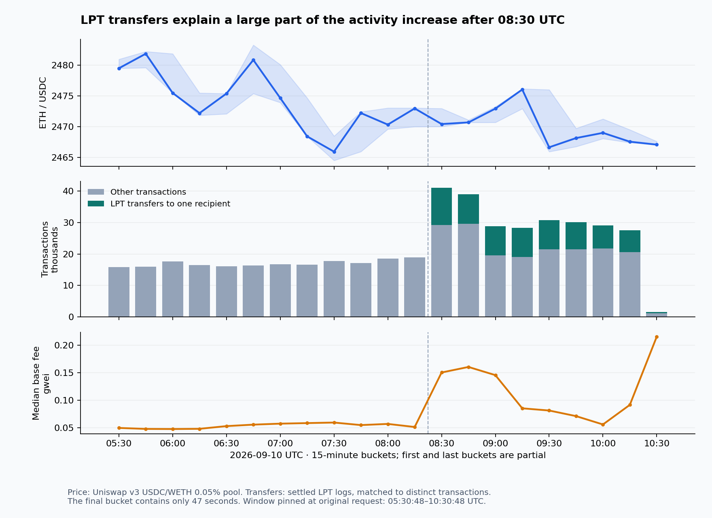

# Ethereum mainnet: a mass transfer burst, thin exits, and recycled volume

**Window: 10 September 2026, 05:30:48–10:30:48 UTC** (09:30:48–14:30:48 Tbilisi), pinned to the finalized head at the original request. This is the requested five-hour study resumed after a pause, not a rolling window at publication. Blocks **25,944,911–25,946,402** contain **460,074 transactions, 1,338,947 logs and 213,622 distinct senders**. Collection is complete; four canonical block-hash rechecks match. [[verify: blocks]] [[verify: transactions]] [[verify: logs]] [[verify: activity-senders]]

ETH slipped **0.53%**, from $2,480.23 to $2,467.07 in the observed USDC/WETH pool, while transaction activity accelerated sharply after 08:30. A large part of that increase was small LPT transfers converging on one address. The lending positions examined are mainly relative-value exposures; there were **zero decoded liquidations** in the covered Aave/Spark/Morpho events. Price source: [activity tables](activity_tables.md); liquidation source: [analysis](analysis.json).

## 72,446 wallets sent LPT to one recipient

**72,446 settled transfers from 72,446 distinct senders sent 161,357.65 LPT to `0x28c6c06298d514db089934071355e5743bf21d60`**, labelled Binance 14 in the existing model-memory registry. This is **99.91% of positive, non-mint/burn LPT transfers** in the window and **15.75% of all Ethereum transactions**. Exactly 72,443 occurred after 08:30, accounting for **28.28% of transactions in the final two hours**. Each matched a direct caller-to-LPT transfer transaction; these are settled movements, not merely calldata instructions. [Full cohort evidence](lpt_consolidation.json), [reusable detector](detectors.json).

The median transfer was **2.1502 LPT**; the 10th–90th percentile range was **2.1067–2.1732 LPT**. 41,207 sending transactions had nonce 1. Concentration, amount similarity and timing are consistent with coordinated consolidation. They do **not** establish common ownership, new users, selling, or an internal exchange sweep. The in-window native-transfer funding graph finds only 54 cohort senders funded by the leading unlabelled candidate, far too few to attribute the whole operation to it. A representative settled transfer is [this transaction](https://etherscan.io/tx/0x6dc3680eff947f69c26ef11ffb5331b5e6199a0fd0511490bac2157ad1b9b595).

The receipt sample includes 17,425 LPT calls, all successful, consuming **4.70% of sampled execution gas**. Their sampled execution fees were just **0.11385 ETH**. Many small transfers can dominate transaction counts without dominating fees. The existing $10,000 priced-flow filter missed this pattern; the new `token_fan_in` detector scans settled ERC-20 transfers without requiring a USD price. LPT totals remain in token units because this study has no validated LPT/USD basis. [Receipt evidence](burst_evidence.json).

## Fees rose, but the main economic fee was still the tip

Total execution burn was **3.46297 ETH**, approximately **$8,543**, calculated from every block header. Fullness was **50.93% of maximum block gas**, close to the fee mechanism's target. This figure alone does not establish spare capacity. [[verify: execution-burn]] [[verify: activity-gas]] [[verify: activity-fullness]]

The systematic every-fourth-block receipt sample covers **373 blocks and 113,684 transactions**. It measures **4.14510 ETH of tips against 0.84591 ETH burned: 4.90×**. These are sampled amounts. Gas-weighted effective-fee p75/p90 were **0.3046/1.3115 gwei**, including tips; 43.65% of sampled gas paid at most 0.01 gwei in priority fees, and 5.87% paid exactly zero. Each sampled receipt set matches its block transactions and gas total. Direct builder/proposer payments and blob fees are outside these execution-tip figures. [Fee census](fee_census.json).

The 08:30 bucket contained **41,020 transactions**, versus 18,938 in the preceding bucket. Median base fee rose from **0.0512 to 0.1504 gwei**, with LPT contributing 11,863 transactions in the 08:30 bucket. USDT activity also rose; attributing the entire fee spike to LPT would overstate the evidence. The existing gas-concentration detector measures requested gas, whereas the receipt figures above measure gas actually used. [Activity tables](activity_tables.md).

## Large low-HF positions are basis trades

Pinned token balances and protocol oracle prices reconcile to aggregate collateral and debt for all three accounts below, with discrepancies below one millionth of a dollar. These are selected borrowers, not a census of all Ethereum positions. [Reproducible exposure checks](borrower_followup.py), [results](borrower_followup.json). Aggregate health identities also pass. [[verify: head-health-identity]]

| Account | Venue | Collateral | Debt | Health factor |
|---|---|---|---|---:|
| `0x3883d8…e4d7` | Spark | 105,113.74 wstETH ($322.49m) | 119,065.66 WETH ($293.73m) | 1.02106 |
| `0xcf0a12…cd69` | Aave v3 | $16.85m USDe + $16.82m sUSDe | $12.74m USDC + $17.56m USDT | 1.02224 |
| `0xca6869…487a` | Aave v3 | 2,910.43 wstETH ($8.93m) | 3,359.72 WETH ($8.29m) | 1.02346 |

For the Spark account, a **2.06% fall in oracle-valued collateral relative to the debt**, holding quantities and thresholds fixed, would take HF to 1. Both legs have ETH exposure, so an equal ETH/USD fall in both does not cause that deterioration. The analogous Aave wstETH/WETH buffer is 2.29%; the USDe/sUSDe account's uniform collateral-value buffer is 2.18% against fixed debt. Market discounts need not transmit one-for-one into protocol oracle marks. [Aave's health-factor definition](https://aave.com/help/borrowing/liquidations) supports this calculation; token composition comes from the pinned RPC evidence, not the web page.

The window also shows collateral moving between venues, including one transaction with **5,000 wstETH supplied and 8,400 WETH borrowed on Spark**, alongside Aave WETH repayment and wstETH withdrawal. This supports active position management, without proving the ultimate owner or intent. [Transaction](https://etherscan.io/tx/0xa53101388b721b2e14691e80a6f5a617942f702c66b7e68515e1bb9a7b37cd08).

## Two tempting signals failed closer inspection

**The apparent PYUSD blackout was a software error.** The first sweep reported 24 minutes with only about $70,935 available. Raw logs instead show high borrowing rates followed by normal rates **later in the same block**, in two separate transactions. The summary sorted tuples by rate rather than log index; the detector carried the wrong terminal rate forward. Historical `getReserveData` reads confirm approximately **4.919% borrow APR and 896,452.48 PYUSD cash** at the close of both affected blocks and at the window endpoint. The corrected detector uses complete end-of-block updates; the false episode is removed. [Ordered logs and historical state](liquidity_followup.json).

**rETH's discount has no meaningful direct redemption capacity at the endpoint.** It traded at a 48.53bp volume-weighted discount to endpoint NAV across $1.206m of observed swaps. But `getTotalCollateral()` returns just **0.000000034007438397 ETH** available for the direct burn path. [Rocket Pool's contract](https://github.com/rocket-pool/rocketpool/blob/master/contracts/contract/token/RocketTokenRETH.sol) includes rETH-contract ETH plus deposit-pool excess in that view and checks it before burning. The initial detector's $1.92m/year model assumed the exit existed. It now returns **no-go**, with conditional arithmetic separated from quoted capacity and earnings. Future liquidity, market exits and longer holding strategies require separate analysis. [Pinned exit read](liquidity_followup.json).

## Rate switches are much smaller after source liquidity is enforced

The scanner now reads underlying cash and withdrawal flags for Aave, Spark and Compound. These are aggregate source ceilings; ownership, collateral constraints, destination caps and liquidity when exiting remain unmeasured. Rates and borrows are held fixed in these models. [Pinned state](head_state.json), [rate detector evidence](detectors.json).

| Switch | Sized capital | Modeled annual gain over source | Binding interpretation |
|---|---:|---:|---|
| Aave USDS → Sky SSR | $8.79m | $292,589 | Source cash; removed the former synthetic $1bn sizing |
| Compound USDT → Aave | $27.15m | $156,024 | Source cash; destination-only optimum was $138.67m / $438,031 |
| Spark USDC → Compound | $0.935m | $6,950 | Destination-rate dilution; about 4.285% after sizing |

Compound's endpoint USDC rate is **5.004%**, but a $1m deposit lowers the modeled rate to **4.235%** and a $5m deposit to **3.217%**. The $0.935m switch earns only about **$6,400/year above the 3.60% Sky benchmark** before accounting for risk differences. PYUSD's $4.40m modeled switch earns 1.749% after dilution, below that benchmark. Endpoint rate gaps are conditional repricing opportunities, not a forecast that the rate persists for a year. [Sampled Compound curve](head_state.json).

## Turnover and flows need their qualifiers

Covered gross DEX volume was **$176.39m**: Uniswap v4 $112.79m, v3 $32.76m, Curve $17.43m, v2-style pools $12.27m, Balancer $1.15m. These are priced swap legs; routed trades can contribute multiple legs. [Decoded venue totals](analysis.json).

Two settled round trips in the recurring `7AΩ∞/WETH` pool generated **$9.868m**, or **5.59% of all priced volume**, while the pool lost only **$0.19269 of WETH before gas**. The detector verifies WETH Transfer settlement against the swaps. Volume-times-fee arithmetic here does not establish LP income, and this pool delta does not establish the sender's total profit. [First round trip](https://etherscan.io/tx/0x066d84a75b617eb0cd9f4ae2878f8db9933ee76dbb4fb639a7118c76b6a014c1), [second](https://etherscan.io/tx/0xbfb13f71e2ae58e0483a6ccaafe09cf56a890b523fabc61a149308ac693101a2), [settlement calculations](detectors.json).

Labelled exchanges show **+$97.15m net stablecoin inflow**, including approximately +$87.25m USDT and +$7.52m USDC. The label sensitivity matters: restricting to model-memory-or-better labels gives **+$111.64m**; the strictly source-verified subset contains only one exchange address and cannot support a market-wide inference. Native ETH's reported **−$1.01m** uses top-level value transfers and does not include internal execution. A deposit is not proof of buying or selling. [[verify: exchange-net-stables]] [[verify: exchange-net-eth]]

There were **10,734 blobs**, led by OP Mainnet (3,055), Base (3,012) and Robinhood Chain (1,692). Consensus withdrawals totalled **14,628.24 ETH**; this does not establish sales or complete validator exits. Titan's self-declared builder string appeared on 740 of 1,492 blocks; that is builder attribution, not validator ownership. [[verify: activity-blobs]] [[verify: activity-withdrawals]]

The existing delegated-dust detector also recorded **119,982 encoded transfer legs**. Among 37,409 testable sender/recipient comparisons, 33.38% matched the lookalike-address rule. These are calldata attempts and pattern matches, not verified losses or a complete internal execution census. [Detector digest](detectors.md).

The infrastructure changes make the main findings repeatable: settled token fan-in detection; source-capped rate sizing; borrower deduplication by account **and venue**; chronological lending-rate summaries; and redemption-availability gating. [Method and commands](method.md), [validation](validation.json), [full generated report](report.md).
